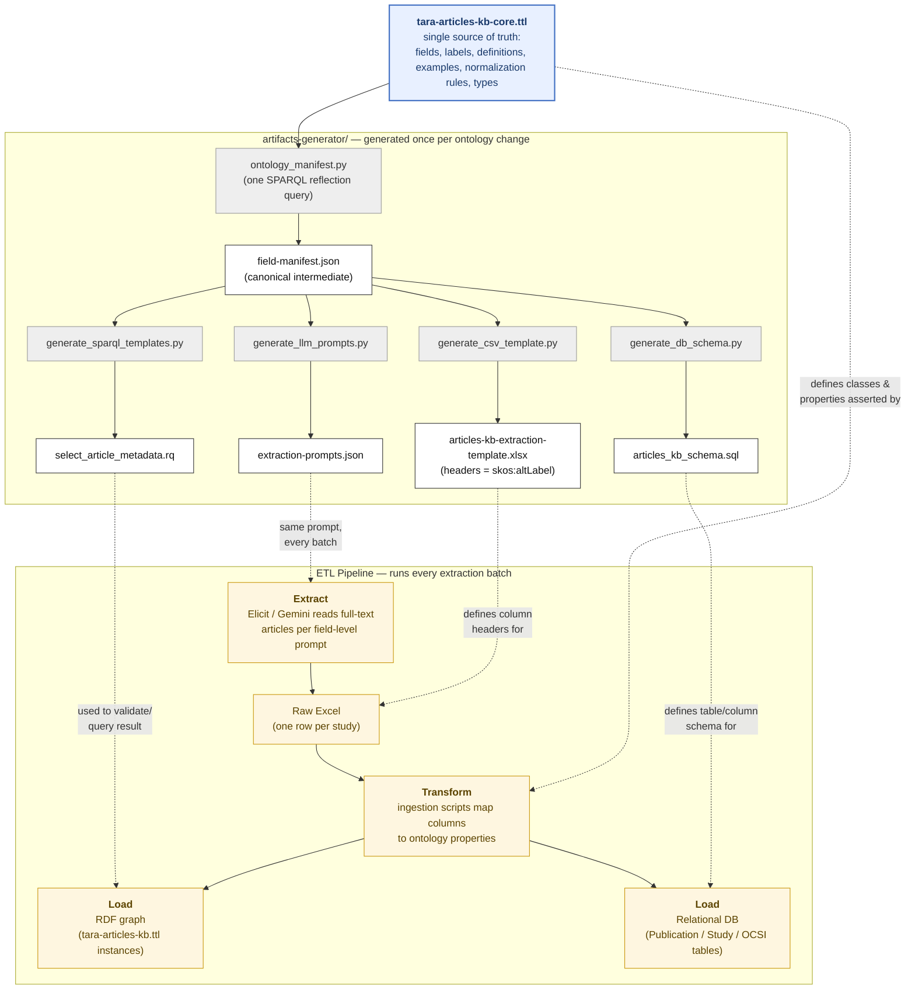
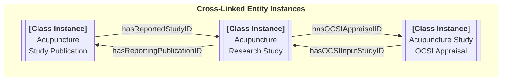
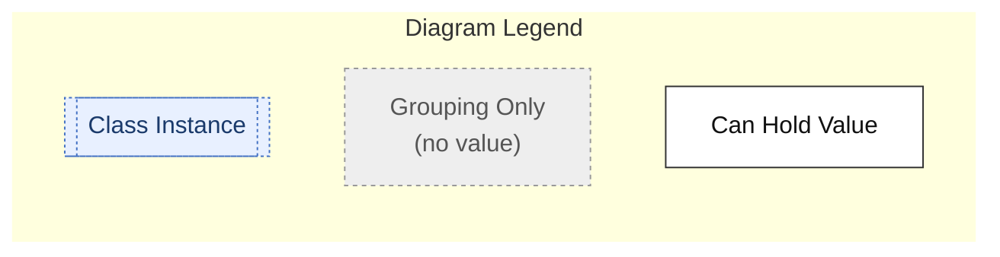
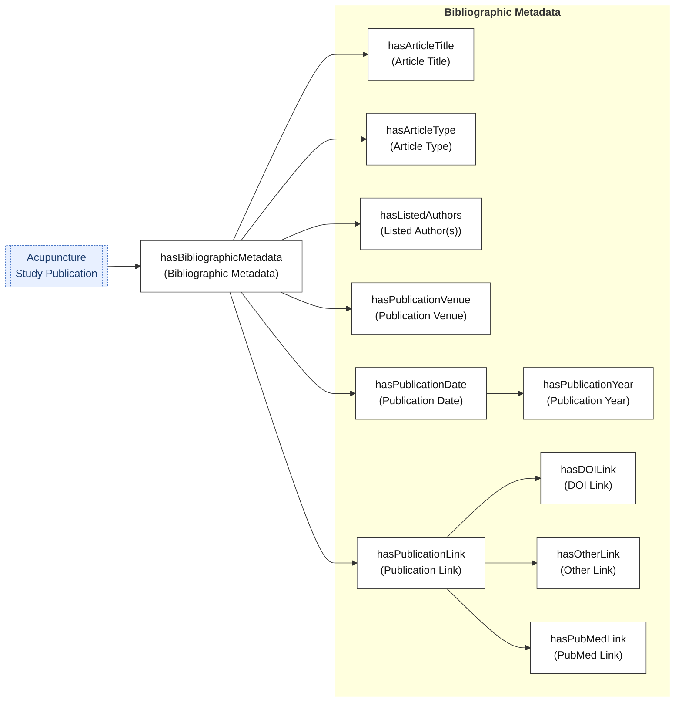
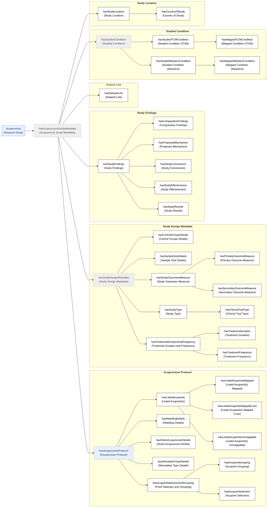
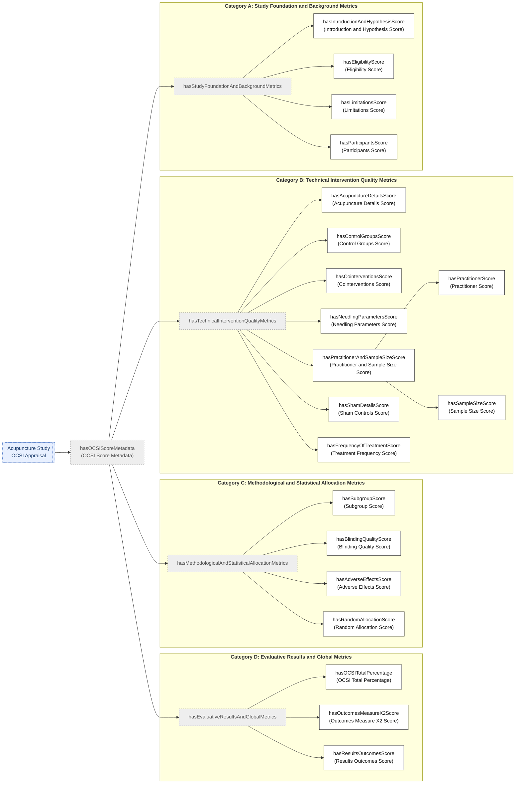
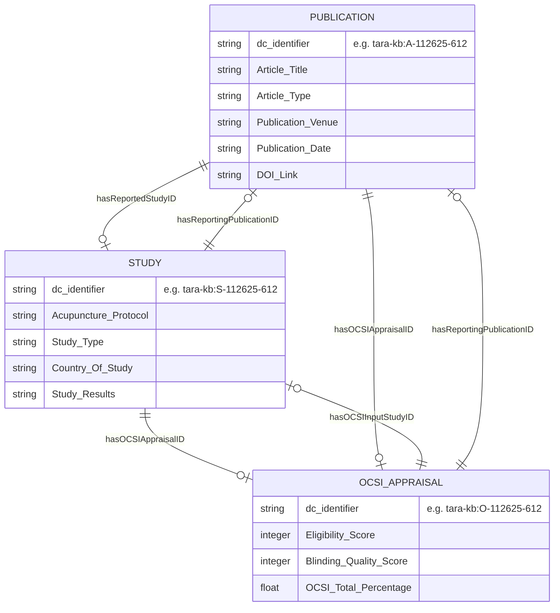

# TARA Articles KB Metadata — Core Ontology

### [Click here to browse this ontology interactively](https://smtifahim.github.io/TARA-Ontology-Repository/articles-kb-core/)

## Purpose

`tara-articles-kb-core.ttl` is the single source of truth for the metadata schema used to capture extracted information from acupuncture clinical trial publications. It exists to solve a recurring ETL problem: metadata extracted via AI tools (Elicit, Gemini, etc.) arrived with inconsistent column names and prompting from batch to batch, which forced the ingestion/transformation scripts to be rewritten every time, and no standardized database schema existed to load into.

This ttl is designed to drive three things directly, so extraction, transformation, and load all stay consistent with one another:

1. **Extraction** — a data dictionary precise enough to generate standardized extraction instructions (prompts) per metadata element for the AI extraction step.
2. **Transformation** — consistent CSV/Excel headers and SPARQL query templates, generated from the ontology rather than hand-maintained.
3. **Load** — a relational database schema derived from the same property definitions used in the RDF graph, so the graph and relational representations never drift apart.

Every annotation property carries `rdfs:label` (human name), `skos:altLabel` (machine-safe column/field name), `dcterms:description` (formal definition), `obo:IAO_0000112` (worked examples), `rdfs:comment` (normalization rules), `rdfs:domain`/`rdfs:range` (owning class / expected value type), and `dcterms:type tara-kb:grouping` where the property is purely organizational and never holds a value itself.

**Status note:** the `obo:IAO_0000112` example values and OCSI scoring rubrics currently in the file are a preliminary starting point and have not yet been verified as authoritative — treat them as draft until reviewed. See also the [LLM Extraction Prompt](#llm-extraction-prompt) section below.

## ETL Architecture

`tara-articles-kb-core.ttl` is not just documentation of the schema — it is the single generation source every downstream artifact is built from. Rather than each ETL stage (extraction prompts, CSV headers, SPARQL, DB schema) hand-maintaining its own copy of "what the fields are," a generator reads the ttl once into a canonical field manifest, and every artifact is derived from that manifest. Adding or renaming a field happens in one place instead of four.

**Why this fixes the original ETL problem:** the ttl's `skos:altLabel` becomes the column name used by both the CSV template *and* the extraction output, so there's no separate mapping step and no drift between the field the LLM was asked for and the field the transform script expects. The `dcterms:description` / `obo:IAO_0000112` / `rdfs:comment` on each property become the extraction prompt and its scoring rubric, injected verbatim every run instead of re-written by whoever is prompting that batch — the direct fix for inconsistent OCSI scores. And `rdfs:range` / `rdfs:domain` drive the DB column types and table assignment, so the relational schema and the RDF graph are generated from the same definitions and can't drift apart.

## Contents

- **`tara-articles-kb-core.ttl`** — the canonical, hand-authored ontology.
- **`tara-articles-kb-core-draft.ttl`** — working draft / staging area for property changes before they're promoted into the core file.
- **`artifacts-generator/`** — generator scripts, one subdirectory per artifact type, each producing the correspondingly-named folder under `generated-artifacts/`. Each script parses `tara-articles-kb-core.ttl` directly with `rdflib`; introduce a shared `ontology_manifest.py` reflection step once more than one generator needs the same field-level traversal.
  - `doc-generator/` — implemented. Two generators: `generate_documentation.py` (writes `tara-articles-kb-core-doc.md` alongside it — class hierarchy, full `tara-kb:hasTARAArticlesMetadata` property tree with domain/range, and a computed Data Quality Notes section) and `generate_html_docs.py` (writes the interactive HTML ontology browser — search/pulldown-autocomplete, expandable trees with a resizable sidebar, browser-history navigation — as `index.html` + `styles.css` to `docs/articles-kb-core/` at the repo root by default, served by GitHub Pages). Run either with `python3 artifacts-generator/doc-generator/<script>.py`.
  - `manifest/` — *(not yet implemented)* will hold `ontology_manifest.py`, the intended canonical field-reflection generator other scripts can share.
  - `csv-templates/` — *(not yet implemented)* will hold the CSV/Excel extraction-template generator.
  - `db-schema/` — *(not yet implemented)* will hold the relational DDL generator.
  - `sparql-templates/` — *(not yet implemented)* will hold the canned SPARQL query-template generator.
  - `llm-prompts/` — *(not yet implemented)* will hold the per-field LLM extraction-prompt generator.
  - `queries/` — *(not yet populated)* reusable SPARQL (`.rq`) query files shared across the generator scripts above.
- **`generated-artifacts/`** — build output only; never hand-edited; regenerated from `artifacts-generator/`.
  - `manifest/` — the canonical intermediate field manifest (compact URI, column name, definition, example, range, domain, parent grouping) that every other generated artifact is built from.
  - `csv-templates/` — generated Excel/CSV extraction templates.
  - `db-schema/` — generated relational DDL.
  - `sparql-templates/` — generated canned SPARQL query templates.
  - `llm-prompts/` — generated per-field LLM extraction prompt payloads.

## Metadata Structure

Under `tara-kb:hasTARAArticlesMetadata`, extracted metadata is organized into branches aligned with three core classes: `Acupuncture Study Publication`, `Acupuncture Research Study`, and `Acupuncture Study OCSI Appraisal`.

In each diagram below,

* A dashed node is a pure grouping property (organizational only, never holds a value)
* A solid node holds an actual extracted value (some solid nodes are also parents of more granular sub-properties)
* A double-bordered node on the left represents an instance of a TARA-KB class (see above)
* See [Entity Relationships](#entity-relationships) below for the full picture with cardinality.

### 1. Acupuncture Study Publication

Bibliographic metadata about an instnace of an Acupuncture Study Publication (e.g., a journal article) reporting a study.

### 2. Acupuncture Research Study

Everything about an instance of an Acupuncture Research Study ; i.e., how the trial was actually conducted as reported in the publication: intervention protocol, design, conditions studied, findings, and study location.

### 3. Acupuncture Study OCSI Appraisal

Everything about an instance of an Acupuncture Study OCSI Appraisal based on a reported study. Each instance contains  structured quality appraisal of trial reporting, based on the Oregon CONSORT/STRICTA Instrument (OCSI), organized into four scoring categories.

## Entity Relationships

The three core classes are cross-linked by dedicated annotation properties rather than a single owning hierarchy, forming a triangle: a Publication reports a Study, a Study is reported by a Publication and appraised by an OCSI record, and an OCSI record traces back to both its input Study and its reporting Publication.

**Class hierarchy:** `Acupuncture Study Publication` is a subclass of `Research Study Publication`; `Acupuncture Research Study` is a subclass of `Research Study`; `Acupuncture Study OCSI Appraisal` is a subclass of `Acupuncture Study Qualty Appraisal`, itself a subclass of `Study Quality Appraisal`.

**Cardinality note:** the `||--o|` (one-to-zero-or-one) cardinality above reflects current pipeline convention — each source spreadsheet row produces exactly one Publication, one Study, and one OCSI Appraisal individual, linked 1:1. This is not an OWL constraint enforced by the ontology (none of these are declared `owl:FunctionalProperty`), so a future scenario such as one Publication reporting multiple Studies (e.g. a multi-arm trial or meta-analysis) is not structurally prevented — just not what the current extraction pipeline produces.

## LLM Extraction Prompt

Work in Progress
