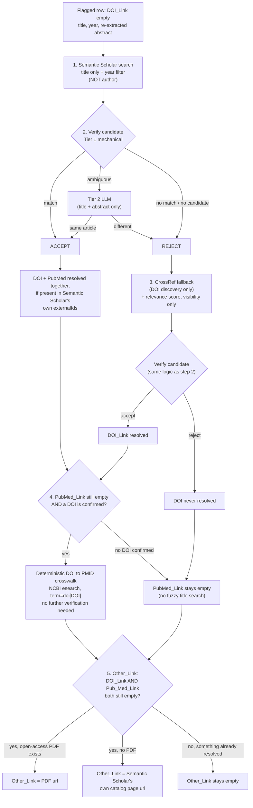

# Link lookup

The DOI / PubMed / Other_Link batch-level post-processing pass.
ETL-Pipeline-Guide.md §8. **Not part of the main extraction loop.** Run
this *after* `extract_articles.py` has already populated a batch's
workbook. It scans the finished `Bibliographic-Metadata` tab for rows
where `DOI_Link` is still empty and tries to fill it (plus `Pub_Med_Link`/
`Other_Link`) from external sources, editing that same workbook in place.

**Redesigned 2026-09-30.** See "The lookup waterfall" and "Same-title
disambiguation" below for the full reasoning. The Guide's own §8
description of this waterfall predates that redesign and no longer
matches what's actually implemented. This README is the current source of
truth for how it works.

## Why this runs after extraction, not during it

Whether a row even needs an external lookup is only knowable once the
Bibliographic branch's own text-extraction has already run. Most articles
already have their DOI in the text, and only the minority that don't need
an API call at all. Running this inline during the Bibliographic call would
mean either calling Semantic Scholar/CrossRef/PubMed unconditionally for
every article (wasteful) or adding a second conditional path inside that
call (breaks the one-shape-per-call structure prompt caching depends on).
See ETL-Pipeline-Guide.md §8 for the full reasoning, including the one real
cost of this timing: the source article's abstract isn't in memory anymore
by this point, so this script re-opens the source PDF (via the registry's
`File_Location`) to re-extract it for verification.

## Setup

```
pip install -r requirements.txt
```

Fill in `.env` (already gitignored) with whichever provider you plan to use
for Tier 2 verification:

```
GEMINI_API_KEY=...
ANTHROPIC_API_KEY=...
```

Two more keys are **strongly recommended**, not just optional. They raise
rate limits on their respective services, and without them you will hit
429s routinely. Live-observed: Semantic Scholar's unauthenticated tier is
shared across *all* unauthenticated users globally, not just you, and gets
throttled easily under any real batch workload.

```
SEMANTIC_SCHOLAR_API_KEY=...   # request at https://www.semanticscholar.org/product/api
NCBI_API_KEY=...               # self-service, instant, via your NCBI account -> Settings -> API Key Management
```

## Usage

```
python3 link_lookup.py --batch 2026-09-28_143205-gemini --provider gemini
```

`--batch` must match `extract_articles.py`'s batch id exactly (same value
`stamp_batch.py` later expects). `--provider` selects which provider's
registry to read `File_Location` from (must match whichever `--provider`
`extract_articles.py` used for this batch), and which LLM answers Tier 2
verification calls. Most rows never reach Tier 2, so this is a light
dependency, not a repeat of the main extraction cost.

**Intended sequencing:**
- `extract_articles.py`
- `link_lookup.py`
- you review the workbook
- `stamp_batch.py`

This script **never touches the registry** (same principle as
`extract_articles.py`; only `stamp_batch.py` writes
`Extraction_Status`/`Extracted_Batch_ID`). It only edits the batch
workbook's `.xlsx` file in place.

## What it reuses from `pre_processing/`, and why

Not copies. The actual same modules, imported directly, because
ETL-Pipeline-Guide.md §8 frames this pass's verification logic as the
*same* logic pre-processing's own duplicate check uses, just running at a
different pipeline stage for a different purpose (see the Guide's own note:
"one module, two distinct call sites; don't let the shared code tempt you
into merging what they're actually doing").

| Reused from `pre_processing/` | Used for |
|---|---|
| `pdf_text.py` | Re-extracting the source article's abstract from its PDF, for verification. |
| `similarity.py` | Tier 1 mechanical title/abstract/year comparison (`mechanical_match_values`). |
| `llm_provider.py` | Tier 2 LLM escalation (`confirm_same_article`), only when Tier 1 is ambiguous. |
| `registry.py` | `Article_ID_Curie` to `File_Location`, to find the right source PDF. |

## Files

| File | Role |
|---|---|
| `link_lookup.py` | Orchestrator / CLI entry point. Run this. Scans the workbook, drives the lookup waterfall per flagged row, writes results back into the same workbook. |
| `external_apis.py` | This package's own: Semantic Scholar / CrossRef / NCBI E-utilities HTTP clients, all sharing one retry/backoff policy. 429/5xx/connection errors are retried with exponential backoff plus jitter, respecting a `Retry-After` header when sent. A genuine 4xx is never retried. |
| `requirements.txt` | Pinned dependency versions for this package. `pip install -r requirements.txt`. |

## The lookup waterfall, per flagged row



1. **Semantic Scholar.** Query by title only, with `year` as a real,
   dedicated filter parameter (not concatenated into the query string). A
   single response can return DOI, PubMed ID, and an open-access PDF URL
   together, already verified via step 2 below.
2. **Verify the candidate.** Tier 1 mechanical checks:
   - title similarity, always
   - abstract similarity too, when both sides have one
   - year exact or ±1

   Escalating to Tier 2 (LLM, title+abstract only, no author names) only
   when Tier 1 is ambiguous. Never guesses: an unconfident Tier 2 call
   returns no-match rather than risk a wrong link. This same verification
   step is reused for every candidate below, not just Semantic Scholar's.
3. If DOI is still unresolved, fall back to a direct **CrossRef** query,
   verified the same way (step 2). CrossRef's own relevance score is
   captured and printed for visibility, but not yet used to change the
   accept/reject decision. No documented, validated threshold exists for
   it yet.
4. If PubMed is still unresolved **and a DOI has been confirmed** (from
   either source above), resolve it via a **deterministic DOI to PMID
   identifier crosswalk** against NCBI (`esearch` with `term=<doi>[DOI]`).
   This is an exact identifier lookup, not a fuzzy search, so it needs no
   separate Tier 1/2 verification. If no DOI was ever confirmed at all,
   `Pub_Med_Link` is simply left empty. **There is no fuzzy, title-based
   PubMed search fallback** (removed 2026-09-30; see "Why no fuzzy PubMed
   search" below).
5. **`Other_Link`.** Only when *both* DOI and PubMed remain unresolved,
   from the already-verified Semantic Scholar candidate, in two tiers:
   1. its `openAccessPdf.url`, a direct link to the article itself, if one
      exists
   2. otherwise, Semantic Scholar's own catalog page about the article. A
      legitimate last-resort `Other_Link` as of 2026-09-30 (previously
      excluded on principle), used only when nothing more direct was found
      at all, and only for a candidate already confirmed correct.

One source being down or rate-limited (retries exhausted) is treated the
same as "no candidate from that source." Printed so a persistent outage is
visible across a run, but never aborts the rest of the waterfall or the
run.

**A missing link (all three fields still empty) is a legitimate, expected
final state**, per the Guide's "accuracy over completeness" design intent.
Never fabricated. `stamp_batch.py`'s completeness check exempts
`DOI_Link`/`Pub_Med_Link`/`Other_Link` from its "no blank cells" rule for
exactly this reason: a blank link after a genuine lookup attempt isn't a
failure.

### Why no fuzzy PubMed search

A direct, title-based PubMed search (`esearch` by free text, then
`esummary`) used to exist as a fallback when no DOI could be confirmed.
Removed by design choice: `esummary`'s response has no abstract to
cross-check against, so verifying a free-text PubMed match has
meaningfully less to go on than verifying a Semantic Scholar or CrossRef
candidate does. A same-titled, different article would be nearly as
likely to be silently accepted as correctly found. Rather than accept that
weaker verification, `Pub_Med_Link` simply stays empty when no DOI was
ever confirmed, consistent with "accuracy over completeness" above.

## Same-title disambiguation

**What the script does *not* do:** look at multiple candidates and pick
among them. Semantic Scholar is queried with `limit=1`. We only ever see
its own single top-ranked result, never a list to disambiguate ourselves.
All discrimination between "this is the right article" and "this merely
looks similar" happens in step 2's verification, against whatever one
candidate came back.

**What actually distinguishes two different articles that happen to share
a title:**

- `year`, now passed as a real Semantic Scholar filter parameter (not
  free-text). Narrows what Semantic Scholar's own ranking considers in
  the first place. A real, free improvement, but not a complete fix: two
  different articles can share both a title and a publication year.
- Abstract similarity (Tier 1, ≥0.80). The strongest actual discriminator,
  since two genuinely different articles will have genuinely different
  abstracts even with an identical title. Only checked when *both* sides
  have abstract text available.
- Tier 2 LLM, when Tier 1 is ambiguous. Also abstract-based: title and
  abstract only, explicitly never author name.

**A known, unresolved gap, not introduced by this redesign:** per Tier 1's
own combination rule, *if abstract data is unavailable on either side,
title+year alone are sufficient to auto-accept*. So two different articles
sharing both a title and a year, with no abstract available on either
side, would currently be indistinguishable to this pipeline. It would
confidently accept whichever one Semantic Scholar's search ranked first.
This is a pre-existing limitation in the verification logic itself, not
something the query-construction fixes in this redesign touch.

**Why author name isn't part of the fix, for now.** It was, briefly, the
original design: concatenating the registry's own `First_Author` field
into the Semantic Scholar query. That caused a real, live-diagnosed bug.
For one real article (first author "Hans-Christoph Diener"), that query
returned *zero* results, while a title-only query correctly found it (with
DOI and PubMed ID both already present). A last-name-only alternative was
considered and rejected too: this registry's own `First_Author` field
isn't consistently formatted enough to extract a surname reliably. For
example:
- `"Juan Antonio Guerra de Hoyos"` has a compound surname
- `"NIU Wen-min"` and `"Cheuk DKL"` are surname-first with initials

A wrong partial-name guess risks reintroducing the same failure for a
different reason.

Checked what structured author data the three APIs themselves can supply,
live:

| Source | Author format (live-checked) | Reliable first/last split? |
|---|---|---|
| CrossRef | `{"given": "Hans-Christoph", "family": "Diener"}`, separate fields per author | ✅ Yes |
| PubMed (`esummary`) | `"Diener HC"`: surname plus bare initials, one string | ⚠️ Partial. Surname is consistently first and parseable, but given name is reduced to initials only |
| Semantic Scholar | `{"name": "Hans-Christoph Diener"}`, one combined string | ❌ No |

CrossRef is the one source with genuinely reliable structured author
names, but it's only available *after* an article is already found by
title, so it can't bootstrap the initial search. Closing the same-title
gap with an author signal would most likely mean fixing it further
upstream instead: having `pre_processing`'s own fingerprint extraction
store `first_name`/`last_name` as separate, reliably-structured fields in
the registry, rather than today's one freeform `First_Author` string, so a
clean surname becomes available to use confidently. Noted as a real
option, not yet pursued. A registry/pre-processing schema change, out of
scope for this package alone.
