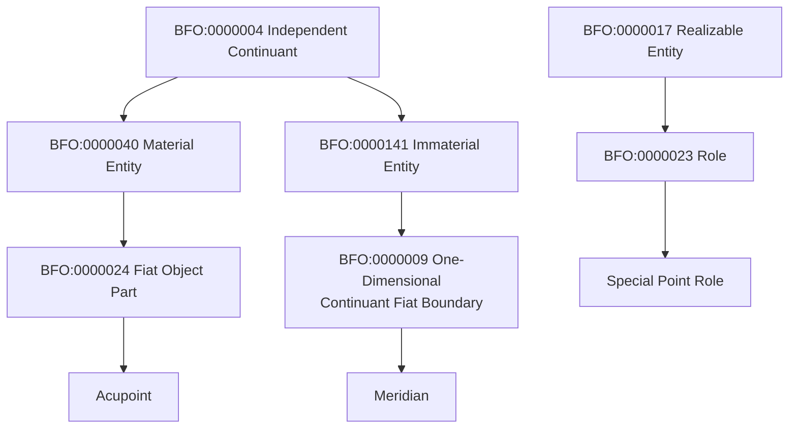
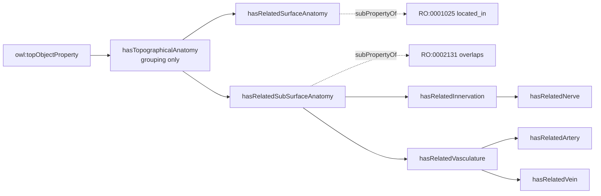

# TARA Acupoints Ontology: BFO/RO Alignment Rationale

This document explains the BFO (Basic Formal Ontology) and RO (Relations Ontology) alignment decisions made for the TARA Acupoints ontology, why the chosen model is coherent and defensible, and why several plausible alternative models were rejected.

## 1. Summary of the Model

| Term                   | BFO/RO Parent                                          | Category                           |
| ---------------------- | ------------------------------------------------------ | ---------------------------------- |
| **Acupoint**           | `BFO:0000024` Fiat Object Part                         | Material, Independent Continuant   |
| **Meridian**           | `BFO:0000009` One-Dimensional Continuant Fiat Boundary | Immaterial, Independent Continuant |
| **Special Point Role** | `BFO:0000023` Role                                     | Realizable Entity                  |

| Property                                                                                                                                        | RO/OWL Parent                           | Domain → Range                                  |
| ----------------------------------------------------------------------------------------------------------------------------------------------- | --------------------------------------- | ------------------------------------------------ |
| `hasTopographicalAnatomy`                                                                                                                       | `owl:topObjectProperty` (grouping only) | Acupoint → Anatomical Entity                    |
| `hasRelatedSurfaceAnatomy` (+ `hasGeneralSurfaceLocation`, `hasSpecificSurfaceLocation`)                                                        | `RO:0001025` `located_in`               | Acupoint → UBERON term (material or immaterial) |
| `hasRelatedSubSurfaceAnatomy` (+ `hasRelatedInnervation` → `hasRelatedNerve`; `hasRelatedVasculature` → `hasRelatedArtery`, `hasRelatedVein`) | `RO:0002131` `overlaps`                 | Acupoint → Nerve/Artery/Vein                    |
| `isLocatedOnMeridian`                                                                                                                           | `RO:0001025` `located_in`               | Acupoint → Meridian                             |
| `hasAssociatedOrgan`                                                                                                                            | ungrounded / top-level                  | Meridian → Organ (UBERON)                       |
| `hasSpecialPointRole`                                                                                                                           | `RO:0000087` `has_role`                 | Acupoint → Special Point Role                   |

## 2. Why Acupoint is a Fiat Object Part (`BFO:0000024`)

An acupoint is not a naturally discontinuous structure — there is no physical seam in the tissue that marks its boundary. It is a **conventionally demarcated volume of the body**, picked out by acupuncture theory rather than by nature. This is precisely the defining case for Fiat Object Part: *a part of a material entity, demarcated by human convention rather than by a natural physical discontinuity* (canonical examples: the upper lobe of the lung, the northern hemisphere of Earth).

**Important clarification on what an acupoint *is not*.** An acupoint has no distinguishing tissue composition or structural identity of its own — it is not a named layer or organ-like structure the way "dermis" or "the deltoid muscle" is. It is simply whatever tissue happens to occupy that location (skin, subcutaneous fat, fascia, sometimes muscle, depending on the point). What makes it *this particular* acupoint is not what it is made of, but **where the fiat boundary is drawn**: at the surface locus where a needle would enter, extending inward — without committing to exact depth or angle — far enough to be understood as reaching the subsurface nerves and vessels the point is defined by. In short: an acupoint is a needle-insertion locus on the body surface, modeled as a small fiat volume that penetrates toward the subsurface nerves and vessels beneath it, without the exact depth or angle of that penetration being specified.

Key reasons this fits the acupoint use case specifically:

- **It is material, but not a distinct kind of tissue.** An acupoint is a **fiat-demarcated volume carved out of whatever pre-existing material entities (skin, subcutaneous tissue, fascia, muscle) occupy that location**, delimited by the practice of needling. Its identity as, e.g., "LU1" — as distinct from the surrounding tissue — comes entirely from TCM/acupuncture convention, not from any physical discontinuity or histological boundary. This still supports the working description that an acupoint "shares a physical piece of substance" with both the skin and the underlying anatomy: it has mass and spatial extent because it is a fiat-drawn portion of material substance, even though it has no independent tissue identity.
- **It supports genuine mereological overlap.** Because both the Acupoint's fiat volume and the nerves/vessels beneath it are material entities occupying the same material continuum, `overlaps` (`RO:0002131`) is a logically valid relation between them — the segment of a nerve or vessel passing through the acupoint's fiat volume is a literal shared part. The overlap is real precisely because the fiat boundary is drawn *through* the same material stuff the nerve/vessel occupies — not because the acupoint has some independent tissue identity of its own.
- **It matches the "needle insertion" semantics.** The needle penetrates the skin surface with some depth and angle; even though depth/angle are not modeled, the acupoint is being treated as a small three-dimensional region the needle occupies — again, a material, extended fiat part, not a dimensionless locus.

## 3. Why Meridian is a One-Dimensional Continuant Fiat Boundary (`BFO:0000009`)

The working TCM definition of a meridian is: *"strings connecting acupuncture points... passageways through which energy flows... each connects to an organ system and extends to an extremity."*

This is geometric/topological language — a **channel or route**, not a set defined by its members. `BFO:0000009` is in fact BFO's own canonical example class for lines of longitude/meridians: a one-dimensional immaterial boundary demarcated purely by convention, with no natural physical discontinuity.

- **Immaterial**: a meridian has no mass or tissue — consistent with "does not exist naturally on the body."
- **Fiat**: it is demarcated by theory (TCM), not by anatomy.
- **One-dimensional**: it is described as a line/channel that *extends* and that acupoints are located *along*, distinguishing it from the 3D Acupoint (Fiat Object Part) and from 2D anatomical surfaces or 3D fossae.

This is why `isLocatedOnMeridian` is modeled as `located_in` (`RO:0001025`) rather than as a collection-membership relation (`RO:0002350`, `member_of`): `member_of` would make the meridian's identity reducible to "the set of its acupoints," contradicting its definition as a channel/passageway. `located_in` correctly expresses "this point lies along this channel" without collapsing the channel into a mere aggregate of its points.

## 4. Why Special Point Role is a Role (`BFO:0000023`)

Whether an acupoint counts as, e.g., a Front-Mu point is **not a function of the acupoint's physical structure** — it is conferred entirely by TCM theory (an external, institutional/doctrinal context), and a different theoretical framework could assign a different designation without any physical change to the acupoint itself. This is exactly BFO's criterion distinguishing **Role** from **Disposition**: a Disposition is grounded in the bearer's intrinsic physical makeup; a Role depends on an external social/institutional/theoretical context.

- **Realizable**: the role is manifested in a process — e.g., a practitioner selecting/needling LU1 *because* it is the Front-Mu point of the Lung.
- **Not a disguised classification tag**: because it is realizable, it is doing more than labeling — it is the kind of thing that structures actual clinical processes.

`hasSpecialPointRole` is modeled as a subproperty of `RO:0000087` (`has_role`) rather than the more generic `RO:0000053` (`bearer_of`), since `has_role` is the RO-idiomatic relation specifically for realizable-entity fillers that are Roles (the same pattern used elsewhere in OBO, e.g., ChEBI's `has_role`).

## 5. Why the Property Hierarchy is Split the Way It Is

A single relation cannot correctly express both the surface-anatomy and subsurface-anatomy branches, because the entities on the range side belong to **different BFO categories**:

| Branch                           | Range examples                                                                                             | BFO category of range         | Valid relation                                                      |
| -------------------------------- | ---------------------------------------------------------------------------------------------------------- | ----------------------------- | ------------------------------------------------------------------- |
| Subsurface (nerve, artery, vein) | supraclavicular nerve, axillary artery                                                                     | Material Entity               | `overlaps` (`RO:0002131`) — valid, since Acupoint is also material |
| Surface (region, fossa, line)    | anterior thoracic region (material), infraclavicular fossa (immaterial), anterior median line (immaterial) | **Mixed** material/immaterial | `located_in` (`RO:0001025`) — tolerates a mixed-category range     |

`overlaps` requires that the two related continuants **share a part**, and BFO parthood is category-preserving (material parts belong to material wholes; immaterial parts belong to immaterial wholes). A material Acupoint cannot share a part with an immaterial fossa or line, so `overlaps` is only valid for the subsurface branch. `located_in` carries no such same-category requirement, which is why it — not `overlaps` — is the superproperty for the surface-anatomy branch and for `isLocatedOnMeridian`.

`hasTopographicalAnatomy` itself is kept as a subproperty of `owl:topObjectProperty` rather than of any RO relation. This is deliberate: it functions purely as an **organizational root** for browsing/querying the Acupoint-specific property tree, and asserts no independent semantic commitment that a reasoner needs to satisfy. (Every OWL object property is already an implicit subproperty of `owl:topObjectProperty`; the explicit assertion here is documentary, not logically additive.)

## 6. Competing / Alternative Models Considered and Rejected

### Modeling Acupoints

### 6.1 Acupoint as a Zero-Dimensional Fiat Point (`BFO:0000018`)

**The intuitive first guess** — "acupoint" sounds like it should be a *point*.

- **Why it fails**: A dimensionless 0-D boundary cannot have parts, and `overlaps` requires shared parthood. Asserting `Acupoint overlaps Nerve` with Acupoint as a true 0-D point is close to incoherent — there is nothing there to share.
- **Also inconsistent with the domain description**: the working understanding explicitly states the acupoint "shares a physical piece of substance" with skin and subsurface anatomy — a claim about mass/extent that a dimensionless point cannot support.

### 6.2 Acupoint as a Site (`BFO:0000029`)

**Considered as an alternative** to preserve the intuition of a bounded, coincident locus without committing to a material reading of Fiat Object Part.

- **Why it fails**: Site is immaterial. The same category mismatch that broke the 0-D point case reappears in the opposite direction: an immaterial Site has no material parts by definition, so it cannot `overlap` a material Nerve, Artery, or Vein. This directly contradicts the "shares a physical piece of substance" requirement.
- **Where it would have worked**: the surface-anatomy branch alone (region/fossa/line terms) is more tolerant of an immaterial range — but this only reinforces that no *single* category choice for Acupoint can validate both branches under `overlaps`. The eventual fix (splitting `located_in` off from `overlaps` for the surface branch) made the Site option unnecessary.

### 6.3 Acupoint as UBERON's `anatomical point` (`UBERON:0006983`)

**Considered** as an alternative to a raw BFO class: reuse UBERON's own `anatomical point` (`UBERON:0006983`), a subclass of `immaterial anatomical entity` (`UBERON:0000466`), since the ontology already draws its surface/subsurface anatomy terms from UBERON.

- **Same category-mismatch problem as 6.1/6.2**: `UBERON:0006983` is immaterial by its own asserted parent class. This reproduces exactly the failure mode already identified for the BFO zero-dimensional fiat point and for Site: an immaterial entity has no material parts, so it cannot `overlap` (`RO:0002131`) the material Nerve, Artery, and Vein instances required by the subsurface branch, and it cannot support the "shares a physical piece of substance" requirement.
- **Scope mismatch, independent of the material/immaterial issue**: existing instances of `UBERON:0006983` in the ontology — e.g., `asterion of skull` — are real, physically-grounded fiat landmarks defined relative to a single, specific real anatomical structure (a named bone or organ), and are recognized in general cross-species comparative anatomy independent of any particular medical theory. An acupoint is not this kind of thing: it is a construct of TCM doctrine, not a landmark recognized in mainstream anatomy. Reusing `UBERON:0006983` would misrepresent the acupoint as an ordinary anatomical landmark rather than a theory-internal, fiat-demarcated locus — the same "does not exist naturally on the body" problem the whole modeling exercise started from.

### 6.4 Meridian as an Object Aggregate (`BFO:0000027`)

**Considered** because `isMemberAcupointOf` was originally modeled as a subproperty of `RO:0002350` (`member_of`), which is the correct relation *for* aggregates.

- **Why it fails for this ontology's stated definition**: `member_of` implies the whole's identity is exhausted by the sum of its members (like a wolf pack). The TCM definition of a meridian — "passageways through which energy flows," "connects to an organ system and extends to an extremity" — describes a geometric channel with a path and direction, not a set defined extensionally by its acupoint membership. Modeling Meridian as an Object Aggregate would be defensible only under a different, purely extensional definition of meridian, which is not the definition in use here.
- **Resolution**: Meridian was kept as a One-Dimensional Continuant Fiat Boundary, and the relation was corrected to `isLocatedOnMeridian` ⊑ `located_in`.

### 6.5 Meridian as UBERON's `anatomical line` (`UBERON:0006800`)

**Considered** for the same reason as 6.4: reuse UBERON's `anatomical line` (`UBERON:0006800`), asserted as a subclass of `non-material anatomical boundary` (`UBERON:0000015`), since it is described as immaterial and line-like — on the surface, a good match for a "channel."

- **Scope mismatch**: existing instances of `UBERON:0006800` — e.g., `intertrochanteric crest`, `spheno-petrosal fissure`, `anatomical line between inner canthi` — are all real, physically-grounded landmarks tied to a single specific anatomical structure (a femur, a skull, the face), recognized in general/cross-species anatomy independent of any particular medical theory. A TCM meridian is a doctrinal construct that runs across multiple organs and regions and is defined entirely within TCM theory, not a landmark on one physical structure recognized by mainstream anatomy. Reusing this class would inherit UBERON's scope — built for real, physically groundable cross-species structures — for an entity that is explicitly *not* that kind of thing.
- **Internal dimensionality ambiguity**: `UBERON:0000015` (`non-material anatomical boundary`, equivalent to CARO:0000010) is textually defined as a *two-dimensional* non-material entity, yet `anatomical line` is asserted beneath it as a seemingly one-dimensional subtype — an unresolved imprecision in UBERON's own dimensional commitments for this branch. Committing Meridian to `UBERON:0006800` would inherit that ambiguity. `BFO:0000009` (One-Dimensional Continuant Fiat Boundary), by contrast, is unambiguously and explicitly one-dimensional, which better matches the "channel/line" description in the working TCM definition.
- **General principle**: BFO's upper-level categories are theory-neutral by design, letting Acupoint and Meridian be classified purely by their own ontological nature (material vs. immaterial, dimensionality, fiat vs. natural boundary) without inheriting the scope and domain-specific assumptions of a mid-level anatomy ontology built for real, physically groundable structures.

### 6.6 Populating `hasSpecialPointDesignation` Instead of (or Alongside) `hasSpecialPointRole`

**Considered** early on, with the intent that `hasSpecialPointRole` would be inferred from `hasSpecialPointDesignation` via a SWRL rule. In practice, `hasSpecialPointDesignation` was never asserted on any acupoint instance — only `hasSpecialPointRole` was ever populated. `hasSpecialPointDesignation` remains defined in the ontology as a reserved, currently-unused property, kept for possible future use (e.g., if a future need arises to distinguish "designation as a matter of record" from "role as a matter of realizable behavior").

- **Why actively using both would fail**: both properties share identical domain (Acupoint) and identical range (Special Point Role), and both are subproperties of `has_role`. Populating both without an active synchronization mechanism (the SWRL rule was never implemented) would create redundant assertions with no guarantee of agreement — a source of silent data drift (one populated, the other empty, or both populated independently and inconsistently).
- **Current practice**: only `hasSpecialPointRole` ⊑ `RO:0000087` (`has_role`) is asserted for actual acupoints. `hasSpecialPointDesignation` is retained in the ontology's property hierarchy but left unpopulated, so there is no live redundancy to manage at present. Should it be activated later, the two properties should be explicitly related (e.g., via an equivalence axiom or a real property chain) rather than left to an unused SWRL rule.

### 6.7 A Single `overlaps`-Rooted Property for All Topographical Relations

**Considered** as the simplest possible design: keep one relation (`hasTopographicalAnatomy` ⊑ `overlaps`) for everything.

- **Why it fails**: UBERON's own class hierarchy is not uniform — surface-location terms resolve to a mix of Material Anatomical Entity (e.g., body regions) and Immaterial Anatomical Entity (e.g., fossae, anatomical lines). No single relation rooted in `overlaps` can be valid across a range that switches category term-by-term. This is what motivated splitting the hierarchy into a `located_in`-rooted surface branch and an `overlaps`-rooted subsurface branch, with the root property demoted to a non-committal grouping relation.

### 6.8 hasSpecialPointRole`as a Subproperty of`bearer_of` (`RO:0000053`)

**Considered** as the initial superproperty choice.

- **Why it is suboptimal rather than outright invalid**: `bearer_of` is the fully general relation between an independent continuant and *any* realizable entity (role, disposition, or function). Since the range here is specifically a Role, RO's more precise idiomatic subproperty `has_role` (`RO:0000087`) is available and communicates intent explicitly to reasoners and downstream ontology consumers, at no additional cost. Retained `bearer_of`-level generality only where the range is not known to be exclusively Role-typed.

### 6.9 `hasAssociatedOrgan` as a Per-Acupoint Property

**Considered, but never implemented**, as a hypothetical alternative: `Acupoint hasAssociatedOrgan Organ`, asserted directly on each of the ~361 acupoints. In the actual ontology, `hasAssociatedOrgan` has always been defined and used at the **Meridian** level only (`Meridian hasAssociatedOrgan Organ`) — it was never asserted per-acupoint.

- **Why the per-acupoint alternative would have been the wrong choice**: the TCM definition places the organ association at the **meridian** level ("each of which connects to an organ system"), not at the level of the individual point. Asserting it per-acupoint would require redundant manual annotation across every point on a given meridian and would risk inconsistency (e.g., a data-entry error on one point but not others on the same meridian).
- **Model as implemented**: `hasAssociatedOrgan` relates **Meridian → Organ**. Acupoints do not carry their own organ assertion; instead, an acupoint's organ association is *derivable* from `isLocatedOnMeridian` (Acupoint → Meridian) together with `hasAssociatedOrgan` (Meridian → Organ). This derivation is not yet materialized as its own property, but remains a natural candidate for a property chain — e.g., `isLocatedOnMeridian` ∘ `hasAssociatedOrgan` → `hasIndirectOrganAssociation` — so that a reasoner can infer an acupoint's associated organ on demand without ever asserting it redundantly on the acupoint itself.

## 7. Summary Table: Rejected vs. Adopted Models

| Entity/Relation             | Rejected Alternative                                                                                   | Reason Rejected                                                                                                                   | Adopted Model                                                                                                            |
| --------------------------- | ------------------------------------------------------------------------------------------------------ | --------------------------------------------------------------------------------------------------------------------------------- | ------------------------------------------------------------------------------------------------------------------------ |
| Acupoint                    | `BFO:0000018` Zero-Dimensional Fiat Point                                                              | Cannot have parts; cannot`overlap` anything                                                                                       | `BFO:0000024` Fiat Object Part                                                                                           |
| Acupoint                    | `BFO:0000029` Site (immaterial)                                                                        | Cannot`overlap` material nerves/vessels                                                                                           | `BFO:0000024` Fiat Object Part                                                                                           |
| Topographical relation      | Single property ⊑`overlaps` for all anatomy                                                           | UBERON range is mixed material/immaterial                                                                                         | Split:`located_in` (surface) / `overlaps` (subsurface)                                                                   |
| Meridian                    | `BFO:0000027` Object Aggregate                                                                         | Definition describes a channel, not an extensional set                                                                            | `BFO:0000009` One-Dimensional Continuant Fiat Boundary                                                                   |
| Acupoint–Meridian relation | `RO:0002350` `member_of`                                                                               | Implies meridian identity = sum of its points                                                                                     | `RO:0001025` `located_in`                                                                                                |
| Special point relation      | Actively populating both`hasSpecialPointDesignation` and `hasSpecialPointRole` via an unused SWRL rule | Would be redundant, unsynchronized, risk of drift                                                                                 | Only`hasSpecialPointRole` populated; `hasSpecialPointDesignation` retained unused, reserved for future consideration     |
| Special point relation      | `RO:0000053` `bearer_of` (generic)                                                                     | Less precise than the idiomatic OBO pattern for Roles                                                                             | `RO:0000087` `has_role`                                                                                                  |
| Organ association           | Per-acupoint`hasAssociatedOrgan` (hypothetical, never implemented)                                     | Would be redundant across every point on a meridian; risk of inconsistency                                                        | Meridian-level`hasAssociatedOrgan`; acupoint's organ derivable via `isLocatedOnMeridian`, optionally as a property chain |
| Acupoint                    | `UBERON:0006983` anatomical point (immaterial anatomical entity)                                       | Cannot`overlap` material nerves/vessels; scope built for real cross-species landmarks, not TCM constructs                         | `BFO:0000024` Fiat Object Part                                                                                           |
| Meridian                    | `UBERON:0006800` anatomical line (non-material anatomical boundary)                                    | Scope built for real single-structure landmarks; parent class's own dimensionality is ambiguous (asserted 2D, subtype implies 1D) | `BFO:0000009` One-Dimensional Continuant Fiat Boundary                                                                   |

## 8. Design Principles Underlying These Decisions

1. **Match BFO category to actual physical/ontological status, not to surface naming.** "Point," "line," and "meridian" are natural-language labels; the correct BFO parent depends on whether the entity has mass/extent, dimensionality, and whether its boundary is natural or fiat.
2. **A relation's validity depends on the categories of *both* its domain and range.** `overlaps` requires same-category (material-material or immaterial-immaterial) parthood; `located_in` does not carry this restriction and is preferred wherever the range is mixed or uncertain across instances (as with UBERON terms).
3. **Prefer the most specific correct RO relation available** (e.g., `has_role` over `bearer_of`) when the range is known to be restricted to a particular realizable-entity subtype.
4. **Avoid redundant properties whose synchronization depends on unimplemented inference** (e.g., a SWRL rule that is never run). If two properties are meant to always agree, either merge them or enforce the relationship with an active OWL axiom (property chain, equivalence).
5. **Model associations at the level of the entity the definition actually attaches them to** — e.g., organ association belongs to the Meridian, not to each individual Acupoint, because that is where the TCM source definition places it.
