# TARA Acupoints Ontology

1. [About TARA Acupoints Ontology](#about-tara-acupoints-ontology)
2. [Ontology Versions Summary](#ontology-versions-summary)
   + [Version 1.0.0 (June 30, 2025)](#version-100-june-30-2025)
   + [Version 0.7.1 (March 20, 2025)](#version-071-march-20-2025)
   + [Version 0.7 (March 15, 2025)](#version-07-march-15-2025)
   + [Version 0.6 (December 12, 2024)](#version-06-december-12-2024)
   + [Version 0.5.1 (July 12, 2024)](#version-051-july-12-2024)
   + [Version 0.5.1 (July 11, 2024)](#version-051-july-11-2024)
   + [Version 0.5 (June 4, 2024)](#version-05-june-4-2024)
3. [Accessing and Exploring the Ontology](#accessing-and-exploring-the-ontology)
   + [Loading the Ontology in Protégé Desktop](#loading-the-ontology-in-protégé-desktop)
   + [Exploring the Ontology in WebProtégé](#exploring-the-ontology-in-webprotégé)
4. [Examples of the Basic Hierarchies](#examples-of-the-basic-hierarchies)
   + [Hierarchy of the Meridians](#hierarchy-of-the-meridians)
   + [Hierarchy of the Meridian Acupoints](#hierarchy-of-the-meridian-acupoints)
   + [Classification of the Special Acupoints](#classification-of-the-special-acupoints)
   + [Inferred Subclasses of a Special Point](#inferred-subclasses-of-a-special-point)
5. [Basic Model of Relationships](#basic-model-of-relationships)
6. [DL Query Examples](#dl-query-examples)
7. [SPARQL Query Examples](#sparql-query-examples)

## About TARA Acupoints Ontology

The TARA Acupoints Ontology is an ontology being developed as part of the [Topological Atlas and Repository for Acupoint Research (TARA)](https://www.acupunctureresearch.org/tara) project funded by the National Institute of Health (NIH). The goal of the project is to establish a new comprehensive resource for the acupuncture research and clinician community. The ontology will be used to support semantic search and annotations for anatomical maps, atlases, and data sets relevant to the TARA project. The ontology takes into account both Eastern and Western nomenclature for acupuncture points. The current scope of the ontology is to develop the semantic modelling of the anatomical and physiological aspects associated with different acupoints located in the main meridians.

Closely following the [Open Biomedical Ontology Foundry](https://obofoundry.org/principles/fp-000-summary.html) (OBO Foundry) principles, the TARA Acupoints Ontology is being developed to support the best practices recommeded by the FAIR principles. These practices include utilizing existing community ontologies where possible, e.g., the Foundational Model of Anatomy (FMA) or UBERON for common anatomical structures, and the use of upper level ontologies like [Basic Formal Ontology (BFO)](https://basic-formal-ontology.org/) and [Relation Ontology (RO)](https://obofoundry.org/ontology/ro.html) ensuring maximum interoperability with other ontologies in biomedical domain. [Navigate to this page](../) to know more about the upper level layers of the TARA Acupoints Ontology. The ontology incorporates anatomical terms imported from [UBERON](https://www.ebi.ac.uk/ols4/ontologies/uberon) and [InterLex](https://scicrunch.org/scicrunch/interlex/dashboard) to specify the anatomical locations of acupoints on the body surface. It also incorporates terms from  Mondo Disease Ontology ([MONDO](https://www.ebi.ac.uk/ols4/ontologies/mondo)) and Human Phenotype Ontology ([HP](https://www.ebi.ac.uk/ols4/ontologies/hp)) to specify the diseases or conditions studied in relation to acupoint use, based on acupoint research literature. These imported terms enable the annotation of studied conditions using standardised vocabulary and support higher-level semantic through the hierarchical structure of the source ontologies.

## Ontology Versions Summary

This section will be updated periodically based on the release of the newer versions of the ontology.

### Version 1.0.0 (June 30, 2025)

* Additional provinance for acupoint metadata annotations including indications, acupuncture method, innervation, and vasculature. Added inline provinance for each annotation "Chinese acupuncture and moxibustion, 1999"
* Enhanced acupoints metadata with additional synonyms.
* The ontology  (Version 1.0.0) is now available via bioportal: https://bioportal.bioontology.org/ontologies/TARA

### Version 0.7.1 (March 20, 2025)

* **Refactored Ontology IRIs** :
  * The namespace for ontology terms has been updated from `http://www.acupunctureresearch.org/tara/ontology/acupoints.owl#` to `http://www.acupunctureresearch.org/tara/ontology/`. This change simplifies namespace handling, improves compatibility with Linked Data standards, and enhances interoperability with other ontologies. All TARA-specific class and property IRIs now follow the updated structure.
    * For example, the IRI for the acupoint labeled as `BL 10` is now referenced as
      `http://www.acupunctureresearch.org/tara/ontology/TARA_0242146` instead of
      `http://www.acupunctureresearch.org/tara/ontology/acupoints.owl#TARA_0242146`
* **Updated Locational Axioms for Acupoints** :
  * The ontology now includes axioms associating acupoints with their surface locations for all meridian acupoints.
  * Additionally, locational axioms have been added for five extra acupoints related to pain conditions found in the literature: Dingchuan, Huatuojiaji, Taiyang, Heding, and Xiyan.
  * The ontology currently includes 1,197 locational axioms, covering 266 unique locations on the body surface.
* **Updated Article Metadata** :
  * The article metadata for pain-related research has been updated with additional acupoints and mapped to TARA standard acupoints.
  * Also includes a cleaner version of the article metadata, particularly correcting cases where needling information was swapped with stimulation types.

### Version 0.7 (March 15, 2025)

* **Expanded Locational Axioms for Acupoints** :
  * Added 1,172 axioms associating acupoints with their surface locations, covering 262 unique locations.
  * Only 18 related surface locations remain to complete the locational axioms for all meridian acupoints. These locations have been identified in FMA and are pending expert review for inclusion in InterLeX.
* **Enhanced Terminology Coverage** :
  * Added additional synonyms for acupoints and meridians to improve semantic alignment and searchability.
* **Incorporated Acupuncture Research Metadata** :
  * Added metadata for 87 unique articles on acupuncture for pain-related conditions, including detailed provenance and study methodologies.
  * Normalized and mapped a major subset of acupoints extracted from the articles to TARA ontology's standard acupoints (113 unique acupoints across different meridians).
  * Mapped a major subset of extracted pain-related conditions studied in the articles to MONDO, HP, and ILX terms, integrating 28 unique conditions into the TARA ontology.
* **Added Annotation Properties for Acupoint-Specific Research Metadata** :
  * Added new properties to incorporate metadata from journal articles on acupuncture treatments for various conditions.
    * Added these properties to capture key details of acupuncture studies:
  * Annotation Properties by Domain and Range :
    * **Domain: Journal Article (DOI); Range: Free Text**
      * `TARA:hasTrialType`, `TARA:hasAcupunctureModality`, `TARA:hasStimulationType`
      * `TARA:hasNeedlingInformation`, `TARA:hasSampleSizeInformation`, `TARA:hasControlsInformation`
      * `TARA:hasListedAcupointsUsed`, `TARA:hasStudiedConditionNote`, `TARA:hasStudiedConditionContext`
      * `TARA:hasCountryInformation`
    * **Domain: Journal Article (DOI); Range: Controlled Term (MONDO/HPO)**
      * `TARA:hasStudiedCondition` – Links studied conditions to standardized MONDO and HPO terms.
    * **Domain: Controlled Term (TARA Acupoint); Range: Journal Article (DOI)**
      * `TARA:isStudiedInArticle` – Captures references to journal articles studying specific acupoints.

### Version 0.6 (December 12, 2024)

* **Updated Ontology** :
  * Included axioms associating the surface locations of acupoints.
  * Added two special properties: `TARA:locatedOnTheSurfaceOf` and `TARA:locatedInRelationTo`, to specify the surface anatomy for each acupoint.
    * `TARA:locatedOnTheSurfaceOf`: Defines the relationship between an acupoint and its general regional location on the body surface.
    * `TARA:locatedInRelationTo`: Defines the relationship between an acupoint and its related proximal location on the body surface.
* **Content Summary** :
  * This version includes all surface locations for the acupoints of the Lung (LU) and Large Intestine (LI) meridians, totaling 31 acupoints.
    * Anatomical terms associated with surface regions are drawn from UBERON (200+ terms) and InterLex (ILX). ILX terms are derived from the Foundational Model of Anatomy (FMA). A total of 55 ILX terms related to surface anatomy were created and imported into the ontology.
    * For the remaining meridian acupoints, this version includes only surface regions associated with UBERON and ILX terms. Regions associated with FMA have been excluded (to be replaced with ILX terms) pending a future release.

### Version 0.5.1 (July 12, 2024)

* Updated the labels for the acupoints of the Governor Vessel and the Conception Vessel
  * Du 1...Du N are udated to GV 1...GV N; Du X are kept as synonyms
  * RN 1...RN N are updated to CV 1...CV N; RN X are kept as synonyms

### Version 0.5.1 (July 11, 2024)

* All the textual IRI suffixes of the class IRIs are automatically converted to numeric suffixes.
  * Example: the OWL class `TARA:Meridian_Acupoint` is converted to `TARA:TARA_5151019`
* Updated preferred labels for `Du Channel` and `Ren Channel` to be `Governor Vessel` and `Conception Vessel` respectively
  * Du Channel and Ren Channel are kept as synonyms
* Updated preferred labels for `Acupoint of the Du Channel` and `Acupoint of the Ren Channel` to be `Acupoint of the Governor Vessel` and `Acupoint of the Conception Vessel` respectively
  * `Acupoint of the Du Channel` and `Acupoint of the Ren Channel` are kept as synonyms

### Version 0.5 (June 4, 2024)

* Classes representing the Meridians
  * Includes 12 main meridians and 2 extra meridians (Du Channel and Ren Channel)
  * Includes associated organs from UBERON for 11 main meridians
* Classification of the Meridian Acupoints
  * Classes representing acupoints located in each of the 14 meridians (Total: 361)
* Classes representing with Extra Acupoints (Extra points)
  * Includes 40 Extra points
* Classes representing the Special Points
  * Classification of Special Points
  * Association of Meridian Acupoints with Special Points
  * Classification of Meridian Acupoints based on Special Point roles
* Associated metadata such as labels, synonyms, abbreviations, Chinese names
  * Also includes textual descriptions for the acupoint locations and special points

## Accessing and Exploring the Ontology

The most recent version of the TARA Acupoints Ontology is [linked here](https://raw.githubusercontent.com/smtifahim/TARA-Ontology-Repository/refs/heads/master/ontology-files/generated/tara-acupoints-merged.ttl). The easiest way to explore the ontology is to load it in **Protégé**. Protégé is a free, open-source ontology editor which you can download from [this link](https://protege.stanford.edu/software.php#desktop-protege).

* The [inferred version of the ontology is linked here](https://raw.githubusercontent.com/smtifahim/TARA-Ontology-Repository/master/ontology-files/generated/tara-acupoints-inferred.ttl). This inferred ontology merges the asserted and inferred axioms of the acupoints ontology plus the upper ontology into a **single turtle file**.
* The [inferred version of the ontology PLUS the articles knowledge base is linked here](https://raw.githubusercontent.com/smtifahim/TARA-Ontology-Repository/refs/heads/master/ontology-files/generated/tara-acupoints-kb-inferred.ttl). This inferred ontology merges the asserted and inferred axioms of the acupoints ontology, the upper ontology, plus the articles annotated articles metadata into a **single turtle file**.

### Loading the Ontology in Protégé Desktop

* Make sure to download the Protégé Desktop Version 5.5.X or higher. If you are not familiar with the Protégé interface there is a "Getting Started" document [linked here](https://protegeproject.github.io/protege/getting-started/).
* Click `File > Open From URL..` in Protégé and copy/paste the [**TARA Acupoints Ontology Link**](https://raw.githubusercontent.com/smtifahim/TARA-Ontology-Repository/refs/heads/master/ontology-files/generated/tara-acupoints-merged.ttl) under the `URI` field. Clicking the `OK` button will load the ontology in Protege.

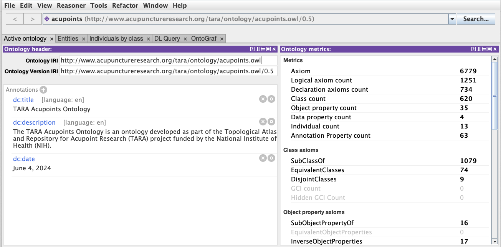

The screenshot above is from TARA Acupoints Ontology - Version 0.5.

### Exploring the Ontology in WebProtégé

The inferred version of the TARA Acupoints Ontology is available explore via the **WebProtégé**. WebProtégé is an open source, lightweight, web-based ontology viewer and editor. The ontology is available in WebProtégé *only for viewing and commenting*. The idea is to gather feedback from acupoint experts.

* If you don't have an account in WebProtégé, [create an account using this link](https://webprotege.stanford.edu/).
* Simply navigate to the following link: [TARA Acupoints Ontology in WebProtege](https://webprotege.stanford.edu/#projects/3be98cb1-fa54-4ddd-a5e8-a9803783b90d/edit/Classes?selection=Class(%3Chttp://www.acupunctureresearch.org/tara/ontology/TARA_1132428%3E))
* If you are new to WebProtégé, please visit the [WebProtégé User Guide](https://protegewiki.stanford.edu/wiki/WebProtegeUsersGuide).

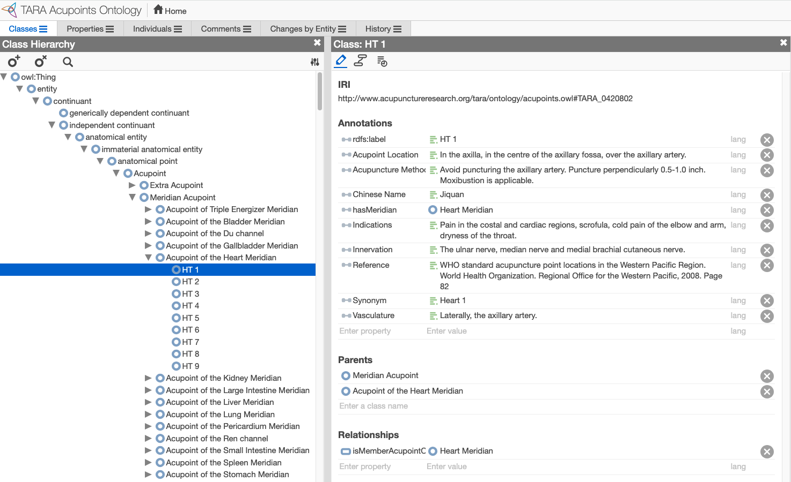

## Examples of the Basic Hierarchies

This sections provides a set of Protégé screenshot examples of the basic hierarchies used in the TARA Acupoints Ontology.

#### Hierarchy of the Meridians

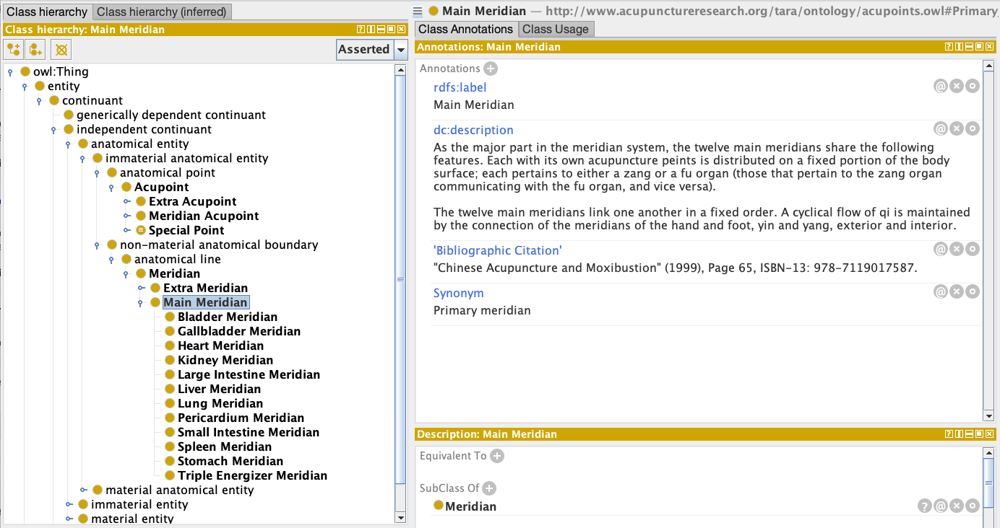

#### Hierarchy of the Meridian Acupoints

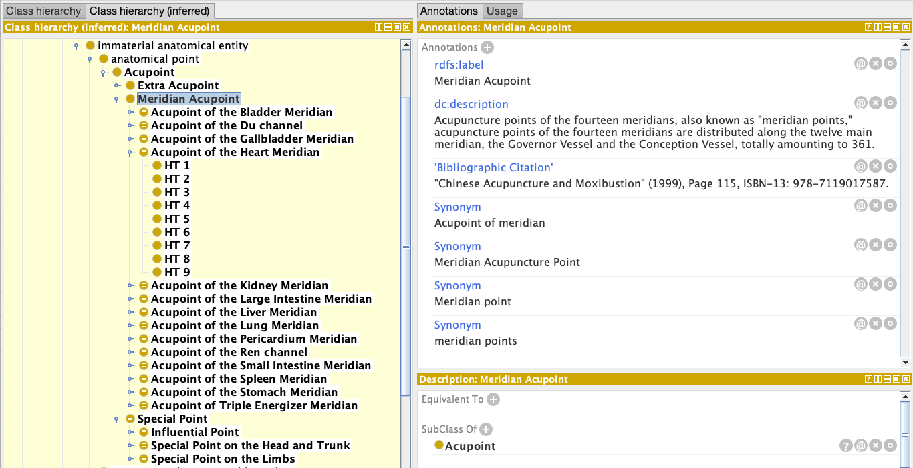

#### Classification of the Special Acupoints

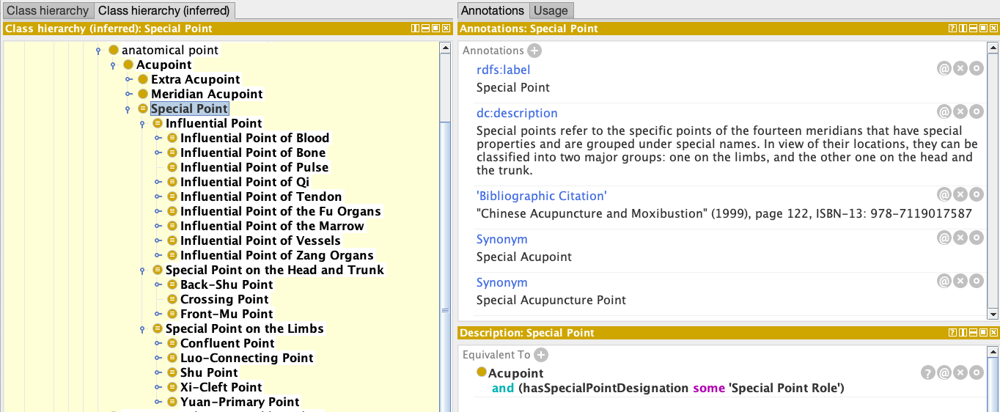

#### Inferred Subclasses of a Special Point

The example shows the inferred subclasses of a special acupuncture point called the "Xi-Cleft Point". The subclasses are the acupoints of different meridans that are considered to be Xi-Cleft points.

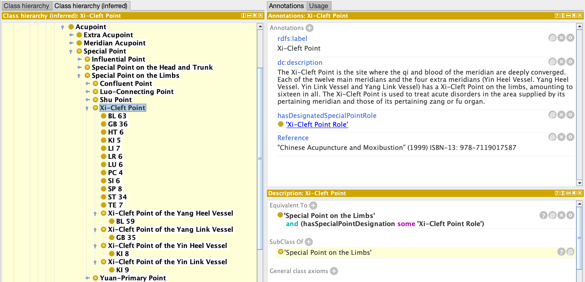

## Basic Model of Relationships

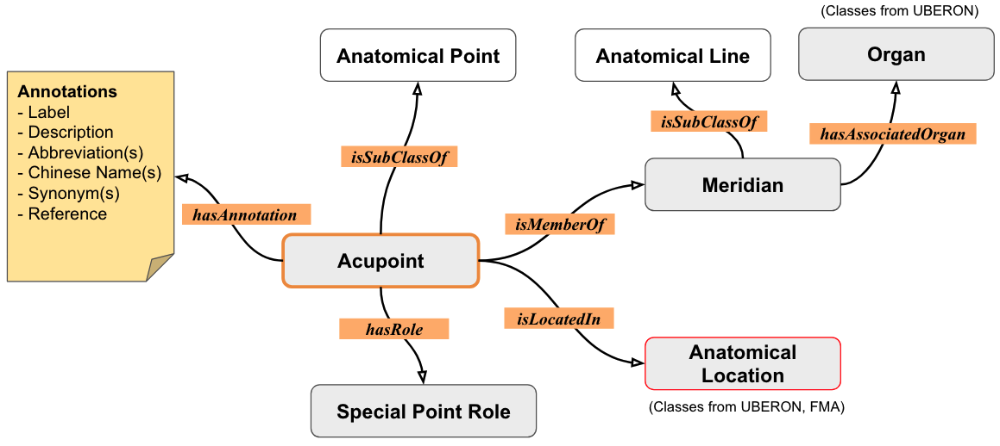

The diagram above provides a high-level depiction of possible relationships for Acupoints in TARA Acupoints Ontology (Version 0.5). It should be noted that not all acupoints require the relationships with meridians as there are many acupoints that do not belong to the standard meridian system. Also, not all acupoints have the special point designations. Only the acupoints of the 12 main meridans and 2 extra meridians, namely the Du Channel and the Ren Channel, have some special point roles.

## DL Query Examples

[The DL Query tab](https://protegewiki.stanford.edu/wiki/DLQueryTab) in Protege provides a powerful feature for testing a classified ontology using class expressions in a standard Description Logic (DL) syntax called the Manchester OWL syntax.

* Before using the DL Query tab, make sure to run the reasoner by selecting `Reasoner > Select HermiT > Start reasoner` in Protege.

This section provides a set of example DL queries to test the basic classifications of the TARA Acupoints Ontology.

**Q: What are the acupuncture points in the Heart Meridan?**

```
'Meridian Acupoint' that isMemberAcupointOf some 'Heart Meridian'
```

Since we have a defined a named class called `'Acupoint of the Heart Meridian'` in the ontology that is equivalent to the class expression above, we can achieve the same result by simply typing the named class as the DL Query.

```
'Acupoint of the Heart Meridian' 
```

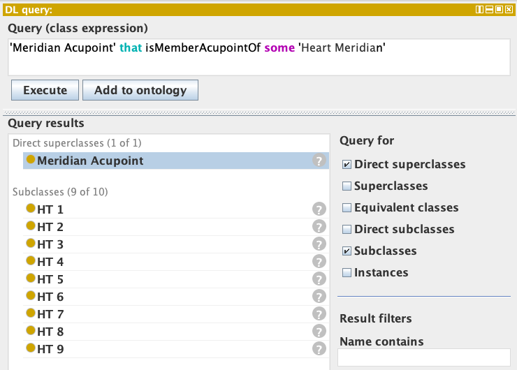

**Q. What are the Xi-Cleft Points in the main meridians?**

```
'Meridian Acupoint' that hasSpecialPointDesignation some 'Xi-Cleft Point Role'
```

Again, since we have defined a named class called 'Xi-Cleft Point' in the ontology as equivalent to the class expression above, we can achive the same result by typing `'Meridian Acupoint' and 'Xi-Cleft Point'`.

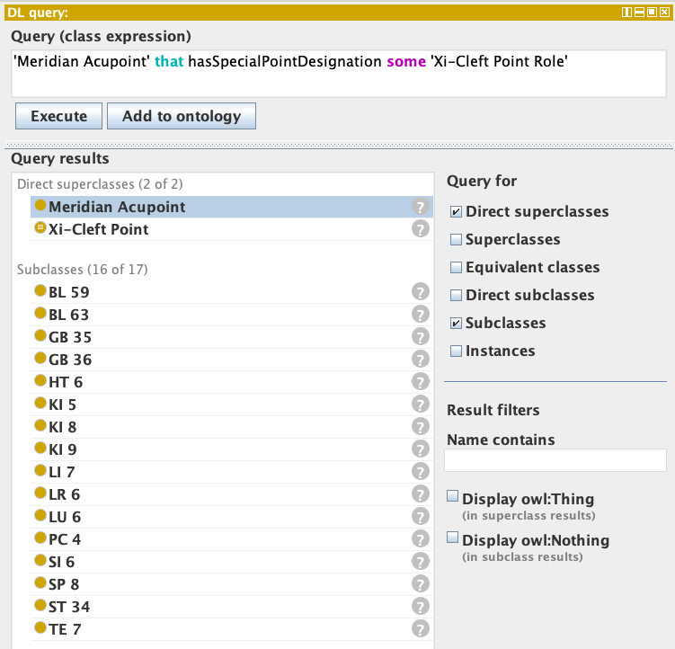

**Q: What are the Xi-Cleft Points on the Kidney Meridian?**

```
'Xi-Cleft Point' and isMemberAcupointOf some (Meridian 
                 and hasAssociatedOrgan some kidney)
```

We are essentially looking for the Xi-Cleft points in the Kidney Meridian; i.e., the acupoints of the kidney meridian that are considered Xi-Cleft points. Since we have a defined class called the 'Acupoint of the Kidney Meridian' as equivalent to the class expression `'Meridian Acupoint' and (isMemberAcupointOf some 'Kidney Meridian')` and we also have 'Kidney Meridan' specified as a subclass of the class expression `'Main Meridian'and (hasAssociatedOrgan some kidney)`, we can simply type the following expression to achieve the same query result.

```
'Xi-Cleft Point' and 'Acupoint of the Kidney Meridian'
```

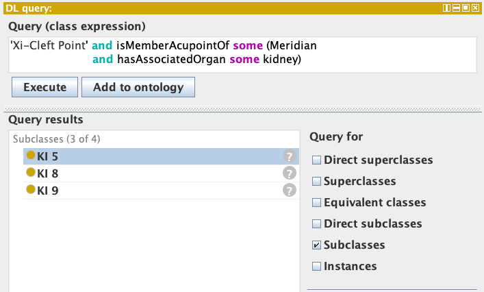

**Q. What are the 8 Confluent Points of the main meridians?**

```
'Confluent Point' and isMemberAcupointOf some 'Main Meridian'
```

Without using the defined class called 'Confluent Point', we would need to use the following expression to achieve the same result.

```
'Meridian Acupoint' and (hasSpecialPointDesignation some 'Confluent Point Role')
```

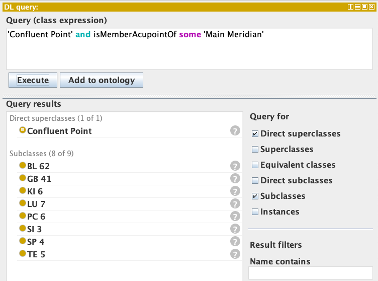

**Q. What are the 15 Luo-Connecting Points of the meridians?**

```
'Meridian Acupoint' and 'Luo-Connecting Point'
```

Again, without using the defined class called 'Luo-Connecting Point' one would need to use the following expression.

```
'Meridian Acupoint' and hasSpecialPointDesignation some 'Luo-Connecting Point Role'
```

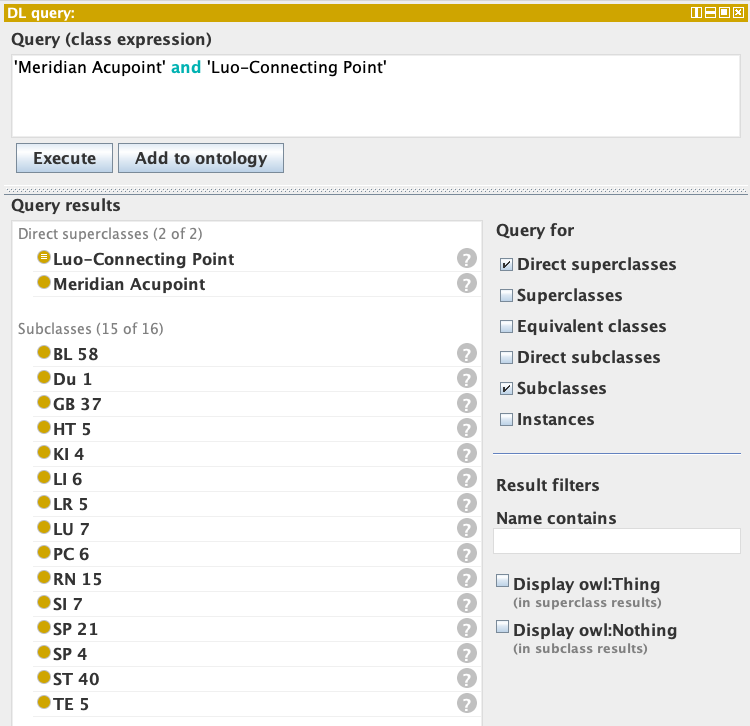

### DL Queries Related to Surface Locations

**Q. What meridian acupoints can be located on the surface of the face?**

```
'Meridian Acupoint' and (locatedOnTheSurfaceOf some face)
```

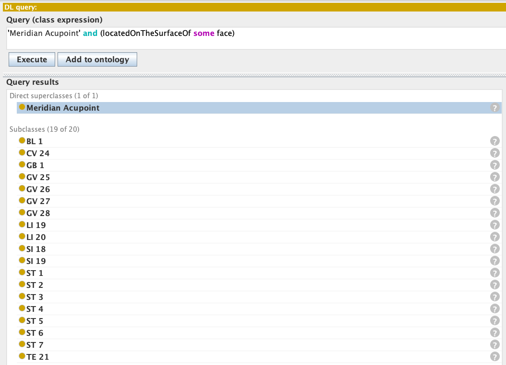

**Q. What meridian acupoints can be located on the surface of the chest?**

```
Acupoint and (locatedOnTheSurfaceOf some ('part of' some chest))
```

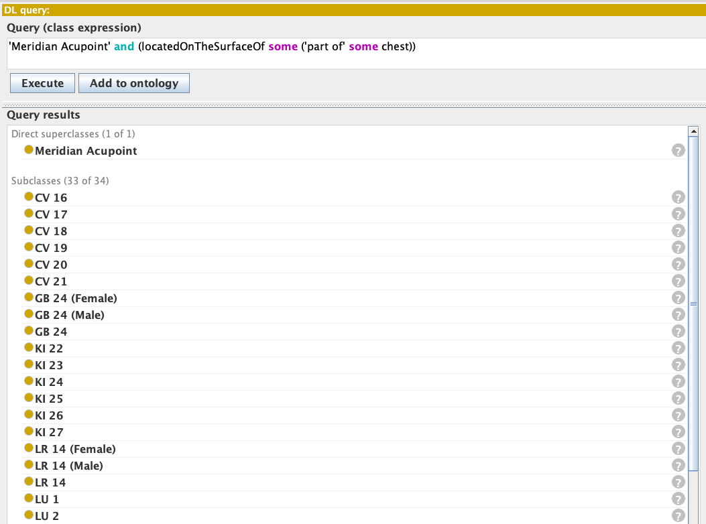

Also try with different parts of the body surface like the following:

**Q. What acupoints are located on the surface of the legs?**

```
Acupoint and locatedInRelationTo some ('part of' some leg)
```

**Q: What acoupoints and located on the surface of the forearm?**

```
Acupoint and (locatedInRelationTo some 'forelimb zeugopod’)
```

## SPARQL Query Examples

### SPARQL Examples in Jupyter Notebook

A set of [example queries are available in a Jupyter Notebook](https://github.com/smtifahim/TARA-Ontology-Repository/blob/master/ontology-files/TARA%20SPARQL%20Query%20Examples.ipynb) to explore the TARA Acupoints Ontology.

**Q. List all the acupoints along with their meridians, special point role, and surface regions.**

```SPARQL
# List all the acupoints along with their meridians, special point role, and surface regions.

PREFIX rdf: <http://www.w3.org/1999/02/22-rdf-syntax-ns#>
PREFIX owl: <http://www.w3.org/2002/07/owl#>
PREFIX rdfs: <http://www.w3.org/2000/01/rdf-schema#>
PREFIX xsd: <http://www.w3.org/2001/XMLSchema#>
PREFIX TARA: <http://www.acupunctureresearch.org/tara/ontology/acupoints.owl#>

SELECT DISTINCT ?acupoint_iri ?acupoint ?meridian ?special_point_role ?surface_region
WHERE 
{
    # FILTER (?acupoint = 'LU 9').

    ?acupoint_iri TARA:hasMeridian/rdfs:label ?meridian.
    ?acupoint_iri rdfs:subClassOf/rdfs:label "Meridian Acupoint".

    OPTIONAL
    {
        ?acupoint_iri TARA:hasDesignatedSpecialPointRole/rdfs:label ?special_point_role.
    }

    OPTIONAL 
    {   
        ?acupoint_iri TARA:hasSurfaceLocation ?surface_region_iri.
        ?surface_region_iri rdfs:label ?surface_region.
    }

    # Exclude generic superclass like 'Acupoint of the X Meridian.
    FILTER (!regex(str(?acupoint), 'Acupoint of the'))
    ?acupoint_iri rdfs:label ?acupoint.
}
ORDER BY ?meridian ?acupoint
limit 1000
```

**Q. What surface regions are associated with a particular acupoint (e.g., LU 9)?**

```SPARQL
# What surface regions are associated with a particular acupoint (e.g., LU 9)?
PREFIX rdf: <http://www.w3.org/1999/02/22-rdf-syntax-ns#>
PREFIX owl: <http://www.w3.org/2002/07/owl#>
PREFIX rdfs: <http://www.w3.org/2000/01/rdf-schema#>
PREFIX xsd: <http://www.w3.org/2001/XMLSchema#>
PREFIX TARA: <http://www.acupunctureresearch.org/tara/ontology/acupoints.owl#>

SELECT ?acupoint ?related_region ?related_region_iri ?surface_region ?surface_region_iri
WHERE 
{
    FILTER (?acupoint = 'LU 9'). 
    ?acupoint_iri TARA:hasRelatedLocation ?related_region_iri.
    ?acupoint_iri TARA:hasSurfaceLocation ?surface_region_iri.

    ?acupoint_iri rdfs:label ?acupoint.
    ?surface_region_iri rdfs:label ?surface_region.
    ?related_region_iri rdfs:label ?related_region.

}
ORDER BY ?acupoint
limit 10
```

### Query Result


| acupoint | related_region                  | related_region_iri | surface_region | surface_region_iri |
| -------- | ------------------------------- | ------------------ | -------------- | ------------------ |
| LU 9     | abductor pollicis longus tendon | ILX:0795335        | carpal region  | UBERON:0004452     |
| LU 9     | carpal region                   | UBERON:0004452     | carpal region  | UBERON:0004452     |
| LU 9     | palmar wrist crease             | ILX:0795334        | carpal region  | UBERON:0004452     |
| LU 9     | radiale                         | UBERON:0001427     | carpal region  | UBERON:0004452     |
| LU 9     | styloid process of radius       | UBERON:7500078     | carpal region  | UBERON:0004452     |
| LU 9     | radial artery                   | UBERON:0001404     | carpal region  | UBERON:0004452     |

**Q. What surface regions are connected by a given meridian (e.g., lung meridian)?**

```SPARQL
# What surface regions are connected by a given meridian (e.g., lung meridian)?

PREFIX rdf: <http://www.w3.org/1999/02/22-rdf-syntax-ns#>
PREFIX owl: <http://www.w3.org/2002/07/owl#>
PREFIX rdfs: <http://www.w3.org/2000/01/rdf-schema#>
PREFIX xsd: <http://www.w3.org/2001/XMLSchema#>
PREFIX TARA: <http://www.acupunctureresearch.org/tara/ontology/acupoints.owl#>

SELECT DISTINCT 
    ?meridian ?acupoint
    ?surface_region  ?surface_region_iri
    ?related_region  ?related_region_iri 

WHERE 
{
    FILTER (?meridian = 'Lung Meridian'). 
    # FILTER (?meridian = 'Liver Meridian').
  
    ?acupoint_iri TARA:hasMeridian ?meridian_iri.
    ?acupoint_iri TARA:hasRelatedLocation ?related_region_iri.
    ?acupoint_iri TARA:hasSurfaceLocation ?surface_region_iri.

    ?acupoint_iri rdfs:label ?acupoint.
    ?meridian_iri rdfs:label ?meridian.
    ?surface_region_iri rdfs:label ?surface_region.
    ?related_region_iri rdfs:label ?related_region.
  
    Filter (?related_region != ?surface_region)

}
ORDER BY ?meridian ?acupoint ?surface_region ?related_region
limit 30
```

### Query Result


| meridian      | acupoint | surface_region       | surface_region_iri | related_region                  | related_region_iri |
| ------------- | -------- | -------------------- | ------------------ | ------------------------------- | ------------------ |
| Lung Meridian | LU 1     | anterior chest       | UBERON:0016416     | anterior median line            | ILX:0795285        |
| Lung Meridian | LU 1     | anterior chest       | UBERON:0016416     | first intercostal space         | ILX:0795283        |
| Lung Meridian | LU 1     | anterior chest       | UBERON:0016416     | infraclavicular fossa           | ILX:0795284        |
| Lung Meridian | LU 10    | palmar part of manus | UBERON:0008878     | metacarpal bone of digit 1      | UBERON:0003645     |
| Lung Meridian | LU 11    | manual digit 1       | UBERON:0001463     | distal phalanx                  | UBERON:0004300     |
| Lung Meridian | LU 11    | manual digit 1       | UBERON:0001463     | nail of manual digit 1          | UBERON:0011273     |
| Lung Meridian | LU 2     | anterior chest       | UBERON:0016416     | anterior median line            | ILX:0795285        |
| Lung Meridian | LU 2     | anterior chest       | UBERON:0016416     | clavipectoral triangle          | ILX:0795286        |
| Lung Meridian | LU 2     | anterior chest       | UBERON:0016416     | coracoid process of scapula     | UBERON:0006633     |
| Lung Meridian | LU 2     | anterior chest       | UBERON:0016416     | infraclavicular fossa           | ILX:0795284        |
| Lung Meridian | LU 3     | arm                  | UBERON:0001460     | anterior axillary fold          | ILX:0795287        |
| Lung Meridian | LU 3     | arm                  | UBERON:0001460     | biceps brachii                  | UBERON:0001507     |
| Lung Meridian | LU 4     | arm                  | UBERON:0001460     | anterior axillary fold          | ILX:0795287        |
| Lung Meridian | LU 4     | arm                  | UBERON:0001460     | biceps brachii                  | UBERON:0001507     |
| Lung Meridian | LU 5     | elbow                | UBERON:0001461     | cubital crease                  | ILX:0795332        |
| Lung Meridian | LU 5     | elbow                | UBERON:0001461     | tendon of biceps brachii        | UBERON:0008188     |
| Lung Meridian | LU 6     | forelimb zeugopod    | UBERON:0002386     | carpal region                   | UBERON:0004452     |
| Lung Meridian | LU 6     | forelimb zeugopod    | UBERON:0002386     | palmar wrist crease             | ILX:0795334        |
| Lung Meridian | LU 7     | forelimb zeugopod    | UBERON:0002386     | abductor pollicis longus tendon | ILX:0795335        |
| Lung Meridian | LU 7     | forelimb zeugopod    | UBERON:0002386     | extensor pollicis brevis tendon | ILX:0795336        |
| Lung Meridian | LU 7     | forelimb zeugopod    | UBERON:0002386     | palmar wrist crease             | ILX:0795334        |
| Lung Meridian | LU 8     | forelimb zeugopod    | UBERON:0002386     | palmar wrist crease             | ILX:0795334        |
| Lung Meridian | LU 8     | forelimb zeugopod    | UBERON:0002386     | radial artery                   | UBERON:0001404     |
| Lung Meridian | LU 8     | forelimb zeugopod    | UBERON:0002386     | styloid process of radius       | UBERON:7500078     |
| Lung Meridian | LU 9     | carpal region        | UBERON:0004452     | abductor pollicis longus tendon | ILX:0795335        |
| Lung Meridian | LU 9     | carpal region        | UBERON:0004452     | palmar wrist crease             | ILX:0795334        |
| Lung Meridian | LU 9     | carpal region        | UBERON:0004452     | radial artery                   | UBERON:0001404     |
| Lung Meridian | LU 9     | carpal region        | UBERON:0004452     | radiale                         | UBERON:0001427     |
| Lung Meridian | LU 9     | carpal region        | UBERON:0004452     | styloid process of radius       | UBERON:7500078     |

**Q. What are the articles that study the treatment of a specific condition (e.g., low back pain, arthritis) or a condition-related context (e.g., pain) using acupoints? List all such articles along with their metadata, and provide a list of all acupoints used in each study.**

```SPARQL
# What are the articles that study the treatment of a specific condition (e.g., low back pain, arthritis) 
# or a condition-related context (e.g., pain) using acupoints? List all such articles along with their metadata, 
# and provide a list of all acupoints used in each study.

PREFIX owl: <http://www.w3.org/2002/07/owl#>
PREFIX rdfs: <http://www.w3.org/2000/01/rdf-schema#>
PREFIX dc: <http://purl.org/dc/elements/1.1/>
PREFIX ilxtr: <http://uri.interlex.org/tgbugs/uris/readable/>
PREFIX TARA: <http://www.acupunctureresearch.org/tara/ontology/>

SELECT DISTINCT

?Studied_Article_IRI 
?Studied_Article_Title
#?Authors 
#?Publication_Venue 
?Publication_Date

(CONCAT(
    COALESCE(?Authors, "Unknown Author"), " (",
    COALESCE(?Publication_Date, "n.d."), "). ",
    COALESCE(?Studied_Article_Title, "No title"), ". ",
    COALESCE(?Publication_Venue, "Unknown venue"), ". "
) AS ?Article_Reference)

?Study_Country 
?Study_Controls ?Trial_Type
?Acupuncture_Modality ?Stimulation_Type
?Needling_Info ?Sample_Size 
(GROUP_CONCAT(DISTINCT ?Studied_Condition; separator=", ") AS ?Conditions_Studied)
?Condition_Note
?Condition_Context
?Listed_Acupoints_Used


WHERE 
{
  FILTER (regex (lcase(?Studied_Condition), 'low back pain')).
  # FILTER (lcase(?Condition_Context) = 'pain').

  FILTER (?Studied_Article_IRI != "")  # Only show results with article data
  ?Acupoint_IRI rdfs:subClassOf*/rdfs:label "Acupoint".
  ?Acupoint_IRI rdfs:label ?Acupoint.

  ?Acupoint_IRI TARA:isStudiedInArticle ?Studied_Article_IRI.
  ?Studied_Article_IRI dc:title ?Studied_Article_Title;
                       TARA:hasAuthor ?Authors.
  
  OPTIONAL {?Studied_Article_IRI TARA:hasPublicationVenue ?Publication_Venue.}
  OPTIONAL {?Studied_Article_IRI TARA:hasPublicationDate ?Publication_Date.}
  OPTIONAL {?Studied_Article_IRI TARA:hasCountryInformation ?Study_Country.}
  
  OPTIONAL {?Studied_Article_IRI TARA:hasTrialType ?Trial_Type.}
  OPTIONAL {?Studied_Article_IRI TARA:hasAcupunctureModality ?Acupuncture_Modality.}
  OPTIONAL {?Studied_Article_IRI TARA:hasStimulationType ?Stimulation_Type.}
  OPTIONAL {?Studied_Article_IRI TARA:hasNeedlingInformation ?Needling_Info.}
  OPTIONAL {?Studied_Article_IRI TARA:hasSampleSizeInformation ?Sample_Size.}
  OPTIONAL {?Studied_Article_IRI TARA:hasControlsInformation ?Study_Controls.}
  OPTIONAL {?Studied_Article_IRI TARA:hasStudiedConditionContext/rdfs:label ?Condition_Context.}
  OPTIONAL {?Studied_Article_IRI TARA:hasListedAcupointsUsed ?Listed_Acupoints_Used.}
  
  OPTIONAL 
  {
    ?Studied_Article_IRI TARA:hasStudiedCondition ?Studied_Condition_IRI.
    ?Studied_Condition_IRI rdfs:label ?Studied_Condition.
  }
  OPTIONAL {?Studied_Article_IRI TARA:hasStudiedConditionNote ?Condition_Note.}
}
GROUP BY
  ?Studied_Article_IRI ?Studied_Article_Title
  ?Authors ?Publication_Venue ?Publication_Date
  ?Study_Country ?Study_Controls ?Trial_Type
  ?Acupuncture_Modality ?Stimulation_Type
  ?Needling_Info ?Sample_Size 
  ?Condition_Note
  ?Condition_Context
  ?Listed_Acupoints_Used
ORDER BY DESC(?Publication_Date)
LIMIT 999
```

### Query Result


| Studied_Article_IRI                                  | Studied_Article_Title                                                                                                                        | Publication_Date | Article_Reference                                                                                                                                                                                                               | Study_Country    | Study_Controls                                                                                                                                                                                                                                                                                                                                                                                                                                                                           | Trial_Type                                   | Acupuncture_Modality                                                                                                                                                                                                                                                                                                                                                                                                                                                                              | Stimulation_Type                                                                                                                                                                                                 | Needling_Info                                                                                                                                                                                                                                                                                                               | Sample_Size                                                                                                             | Conditions_Studied | Condition_Note                            | Condition_Context | Listed_Acupoints_Used                                       |
| ---------------------------------------------------- | -------------------------------------------------------------------------------------------------------------------------------------------- | ---------------- | ------------------------------------------------------------------------------------------------------------------------------------------------------------------------------------------------------------------------------- | ---------------- | ---------------------------------------------------------------------------------------------------------------------------------------------------------------------------------------------------------------------------------------------------------------------------------------------------------------------------------------------------------------------------------------------------------------------------------------------------------------------------------------- | -------------------------------------------- | ------------------------------------------------------------------------------------------------------------------------------------------------------------------------------------------------------------------------------------------------------------------------------------------------------------------------------------------------------------------------------------------------------------------------------------------------------------------------------------------------- | ---------------------------------------------------------------------------------------------------------------------------------------------------------------------------------------------------------------- | --------------------------------------------------------------------------------------------------------------------------------------------------------------------------------------------------------------------------------------------------------------------------------------------------------------------------- | ----------------------------------------------------------------------------------------------------------------------- | ------------------ | ----------------------------------------- | ----------------- | ----------------------------------------------------------- |
| https://doi.org/10.1371/journal.pone.0000919         | Naturopathic Care for Chronic Low Back Pain: A Randomized Trial                                                                              | 2007             | Orest Szczurko, Kieran Cooley, Jason W Busse, Dugald Seely, Bob Bernhardt, Gordon H Guyatt, Qi Zhou, Edward J Mills (2007). Naturopathic Care for Chronic Low Back Pain: A Randomized Trial. PLoS ONE.                          | Canada           | The control group received standardized physiotherapy advice, which included an educational booklet designed by the British Physiotherapy Association. This booklet provided information on back pain management, including causes, prognosis, appropriate use of imaging studies and specialists, and exercises for promoting recovery and preventing recurrences. Participants were also instructed on specific back stretching and strengthening exercises and relaxation techniques. | RCT                                          | The acupuncture modality involved twice-weekly sessions for 12 weeks, using Seirin disposable needles number 5 (0.25630 mm) inserted at specific points (GV 3,4, BL 23, 25, 40 bilaterally) to a depth of 0.5 cun, with stimulation to achieve de qi and left in place for 20 minutes per session.                                                                                                                                                                                                | Manual stimulation to achieve de qi sensation; needles left in place for 20 minutes                                                                                                                              | Needle depth: 0.5 cun; Needle angle: Not mentioned                                                                                                                                                                                                                                                                          | Total: 75 participants; Naturopathic care group: 39 participants; Control group: 36 participants                        | Low back pain      | chronic low back pain                     | Pain              | GV 3, GV 4, BL 23, BL 25, BL 40                             |
| https://doi.org/10.1136/aim.22.2.60                  | Acupuncture for low back pain in pregnancy -a prospective, quasi-randomised, controlled study                                                | 2004             | João Bosco, Guerreiro Da Silva, Mary Uchiyama Nakamura, José Antonio Cordeiro, Luiz Kulay, Mary Uchiyama (2004). Acupuncture for low back pain in pregnancy -a prospective, quasi-randomised, controlled study. .         | Brazil           | The control group received conventional treatment only, which included paracetamol and hyoscine.                                                                                                                                                                                                                                                                                                                                                                                         | quasi-randomised, pragmatic controlled study | Traditional needle-based acupuncture using classical points without electro-stimulation or ear acupuncture, involving the insertion of approximately 12 needles for about 25 minutes per session.                                                                                                                                                                                                                                                                                                 | Manual stimulation to elicit de qi; no specific frequency mentioned                                                                                                                                              | Not mentioned (the paper does not specify the exact needle depth or angle of insertion)                                                                                                                                                                                                                                     | Total: 61 participants; Study group (acupuncture): 27; Control group: 34                                                | Low back pain      | low back and pelvic pain during pregnancy | Pain              | KI 3, SI 3, BL 62, BL 40, TE 5, GB 30, GB 41, Huatuojiaji   |
| https://doi.org/10.1111/j.0001-6349.2004.0215.x      | Acupuncture relieves pelvic and low-back pain in late pregnancy                                                                              | 2004             | Nina Kvorning, Catharina Holmberg, Lars Grennert, Anders A Àöberg, Jonas A Àökeson (2004). Acupuncture relieves pelvic and low-back pain in late pregnancy. .                                                               | Sweden           | The controls in the study were untreated; they did not receive any sham stimulation or placebo treatment.                                                                                                                                                                                                                                                                                                                                                                                | Randomized Controlled Trial (RCT)            | Traditional acupuncture points and local tender points were used, with periostal stimulation when possible. Specific points included LR3, GV20, BL60, SI3, and others, with needle insertion techniques varying (tangentially, obliquely, perpendicularly) and achieving Dechi was a goal. Treatment frequency was initially twice a week, then once a week.                                                                                                                                      | Manual stimulation with periostal stimulation when possible; needles manipulated to achieve Dechi, repeated after 30-60 seconds; frequency: twice a week for the first two weeks, then no more than once a week. | Needle depth: 2.5-inch needles for lumbar and sacral bladder points, minimal gluteal muscle tendon, sacroiliac tendons; 1.0-inch needles for symphysis. Needle angle: tangentially for lumbar and sacral bladder points and minimal gluteal muscle tendon, obliquely for sacroiliac tendons, perpendicularly for symphysis. | Total: 72 participants; Acupuncture group: 37 participants; Control group: 35 participants                              | Low back pain      | pelvic and low-back pain during pregnancy | Pain              | LR 3, GV 20, BL 60, SI 3, BL 22, BL 23, BL 24, BL 25, BL 26 |
| https://doi.org/10.1097/00002508-200311000-00004     | Acupuncture in the Management of Chronic Low Back Pain: A Blinded Randomized Controlled Trial                                                | 2003             | Daniel P Kerr, Deirdre M Walsh, David Baxter (2003). Acupuncture in the Management of Chronic Low Back Pain: A Blinded Randomized Controlled Trial. The Clinical Journal of Pain.                                               | Northern Ireland | Placebo transcutaneous electrical nerve stimulation (TENS) using a nonfunctioning TENS machine                                                                                                                                                                                                                                                                                                                                                                                           | Randomized Controlled Trial (RCT)            | The acupuncture modality involved using Seirin acupuncture needles No. 8 (0.30 √ó 50 mm) inserted at specific points (Bladder 23, 25, Gall Bladder 30, Bladder 40, Kidney 3, and Governor Vessel 4) until the sensation of ""ch'i"" was produced. The needles were manually rotated during 30-minute sessions conducted weekly over a 6-week period.                                                                                                                                            | Manual rotation of needles at initial insertion and at 10-minute and 20-minute intervals during a 30-minute session                                                                                              | Not mentioned (the paper does not specify the exact needle depth or angle, only that needles were inserted until the sensation of ""ch'i"" was produced)                                                                                                                                                                    | Total: 60 participants; Acupuncture group: 30 initially (26 completed); Placebo-TENS group: 30 initially (20 completed) | Low back pain      | chronic low back pain                     | Pain              | BL 23, BL 25, GB 30, BL 40, KI 3, GV 4                      |
| https://doi.org/10.1089/107555303322284767           | The Use of Electro-Acupuncture in Conjunction with Exercise for the Treatment of Chronic Low-Back Pain                                       | 2003             | Cecilia K N Yeung, Mason C P Leung, Daniel H K Chow (2003). The Use of Electro-Acupuncture in Conjunction with Exercise for the Treatment of Chronic Low-Back Pain. Journal of Alternative and Complementary Medicine.          | Hong Kong        | The control used in the study was a standardized back exercise program without electro-acupuncture. This included warm-up, stretching, back extension exercises, abdominal exercises, cool-down stretching, advice on spinal anatomy and body mechanics, back care, postural correction, lifting and ergonomic advice, behavioral modification, and a series of home exercises.                                                                                                          | RCT (Randomized Controlled Trial)            | Electro-acupuncture (EA) with electrical stimulation at 2 Hz using a biphasic waveform applied to specific acupoints along the Bladder and Spleen meridians                                                                                                                                                                                                                                                                                                                                       | 2 Hz electrical stimulation with biphasic waveform (positive wave in square form and negative wave in triangle form with 0.5-ms pulse width)                                                                     | Needle length: 40 mm; Needle depth adjusted based on patient sensation; Needle angle not mentioned                                                                                                                                                                                                                          | Total: 52 participants; Exercise group: 26; Exercise plus EA group: 26                                                  | Low back pain      | Chronic Low-Back Pain                     | Pain              | BL 23, BL 25, BL 40, SP 6                                   |
| https://doi.org/10.1016/s0304-3959(02)00269-5        | Does acupuncture improve the orthopedic management of chronic low back pain -a randomized, blinded, controlled trial with 3 months follow up | 2002             | Albrecht F Molsberger, Jochen Mau, Danuta B Pawelec, Ja ´nos Winkler (2002). Does acupuncture improve the orthopedic management of chronic low back pain -a randomized, blinded, controlled trial with 3 months follow up. . | Germany          | Sham 1 COT (non-specific needling and COT) and nil 1 COT (COT alone)                                                                                                                                                                                                                                                                                                                                                                                                                     | RCT (Randomised Controlled Trial)            | Verum acupuncture involving needling specific acupuncture points, with sessions lasting 30 minutes each, administered three times a week for a total of 12 sessions. The treatment was performed by a trained medical doctor using standard points in the lumbar region and lower extremity, with needle insertion depth ranging from 1 to 10 cm to achieve Deqi sensation.                                                                                                                       | Manual needle manipulation with mild to strong intensity, three times per week for 30 minutes per session.                                                                                                       | Verum acupuncture: 1 to 10 cm; Sham acupuncture: less than 1 cm                                                                                                                                                                                                                                                             | Total: 186 participants, Verum 1 COT: 65, Sham 1 COT: 61, Nil 1 COT: 60                                                 | Low back pain      | chronic low back pain                     | Pain              | BL 23, BL 25, GB 30                                         |
| https://doi.org/10.1034/j.1600-0412.2000.079005331.x | A prospective randomized study comparing acupuncture with physiotherapy for low-back and pelvic pain in pregnancy                            | 2000             | Kaj Wedenberg, Berit Moen, √Ösa Norling (2000). A prospective randomized study comparing acupuncture with physiotherapy for low-back and pelvic pain in pregnancy. .                                                          | Sweden           | The control in the study was the physiotherapy group, which was used to compare against the acupuncture group.                                                                                                                                                                                                                                                                                                                                                                           | RCT (Randomized Controlled Trial)            | The acupuncture modality involved treatments three times a week for the first two weeks, then twice a week, totaling 10 sessions over a month. It used sterilized steel needles (1-10 cm long, 0.25-0.38 mm thick), with 2 to 10 needles per session. Treatments started with ear-acupuncture at the fossa triangularis, supplemented by body-acupuncture at points Bl 26-30, Bl 60, Cw 2, and local points. The deqi-sensation was elicited, and needles were tapped or rotated for stimulation. | Manual stimulation: needles were gently tapped or rotated about 15 minutes after insertion to elicit the deqi-sensation.                                                                                         | Needle depth: 1-10 centimeters; Angle: Not mentioned                                                                                                                                                                                                                                                                        | Total: 60 participants, Acupuncture group: 30 (28 analyzed), Physiotherapy group: 30 (18 completed)                     | Low back pain      | low-back and pelvic pain during pregnancy | Pain              | BL 26, BL 27, BL 28, BL 29, BL 30, BL 60                    |

**Additional example queries will be added based on the use cases of the TARA ontology as part of this section.**
