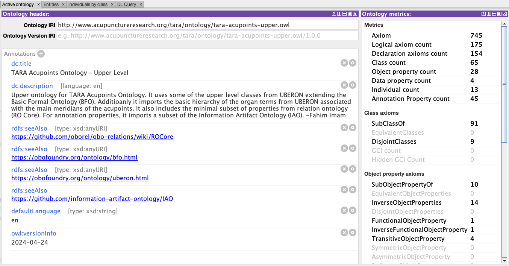
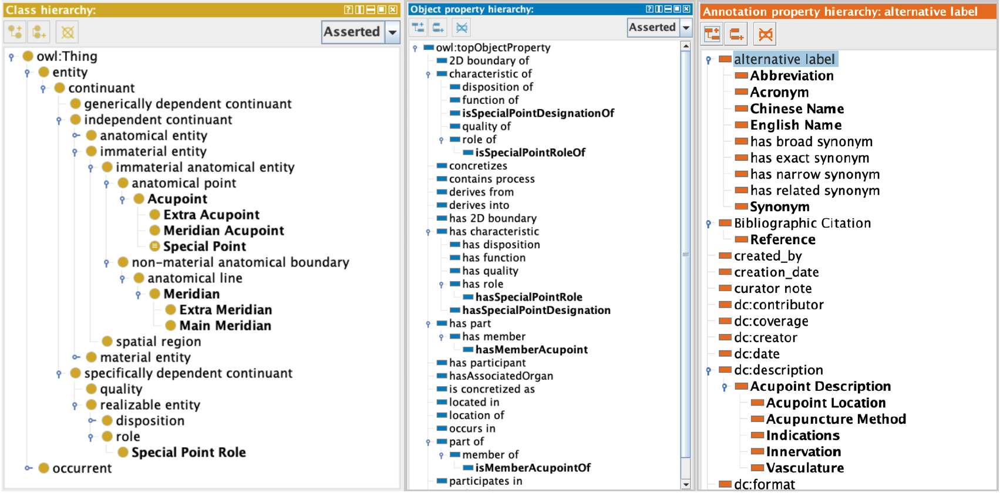

# TARA Ontology Files

This directory contains the ontology files needed for the ontology adapter. The `tara-acupoints-upper.ttl` file contains a subset of classes and properties along with their hierarcies from upper level ontologies commonly reused by standard biomedical ontologies. Extending the upper level classes and properties, `tara-acupoints-core.ttl` contains the core classes and properties relevant to the TARA Acupoints Ontology.

## TARA Acupoints Ontology - Upper Level

The upper-level ontology for TARA Acupoints Ontology (`tara-acupoints-upper.ttl`) reuses a subset of the upper level classes from [UBERON](https://obofoundry.org/ontology/uberon.html) that extend the [Basic Formal Ontology](https://obofoundry.org/ontology/bfo.html) (BFO). Additioanly, it imports the basic hierarchy of the organ terms from UBERON associated with the main meridians of the acupucture points. It also includes the minimal subset of properties from [Relation Ontology](https://obofoundry.org/ontology/ro.html) (RO Core). For annotation properties, it includes a subset of annotation properties from the [Information Artifact Ontology](https://github.com/information-artifact-ontology/IAO) (IAO) and [Dublin Core Metadata](https://www.dublincore.org/specifications/dublin-core/dcmi-terms/#section-3) (DC).

## TARA Acupoints Ontology - Core

The core ontology (`tara-acupoints-core.ttl`) includes the core classes and properties specific to the acupoints ontology along with logical axioms. It imports the upper ontology and extends the upper level classes and and properties. This ontology is used as the base to generate the TARA Acupoints Ontology. The Protege screenshots below show the core classes and properties (the ones in bold fonts) specific to the acupoints ontology extedning the upper level classes and properties.

**NOTE:** The core ontology currently includes the classes and properties needed for the `Version 0.5` of the TARA Acupoints Ontology. Additional classes and properties will be added as needed for the future versions.

## TARA Acupoints Ontology - Main

The main ontology generated by the [ontology adapter](../csv-adapter) (`./generated/tara-acupoints.ttl)` extends the core ontology to include all the asserted classes and logical axioms transformed from the [curated CSV file contents](../csv-files). Please navigate to the [Main Ontology Page](./generated) for more details.
