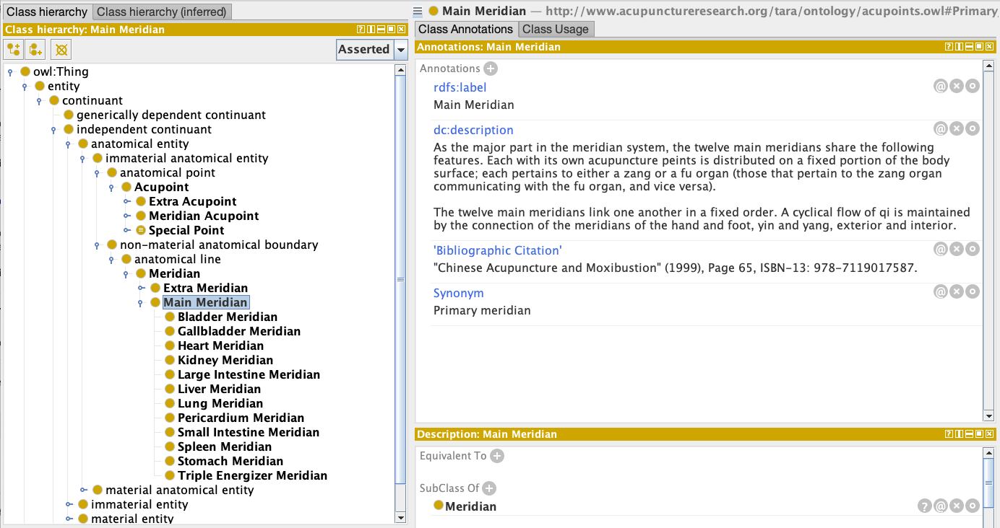
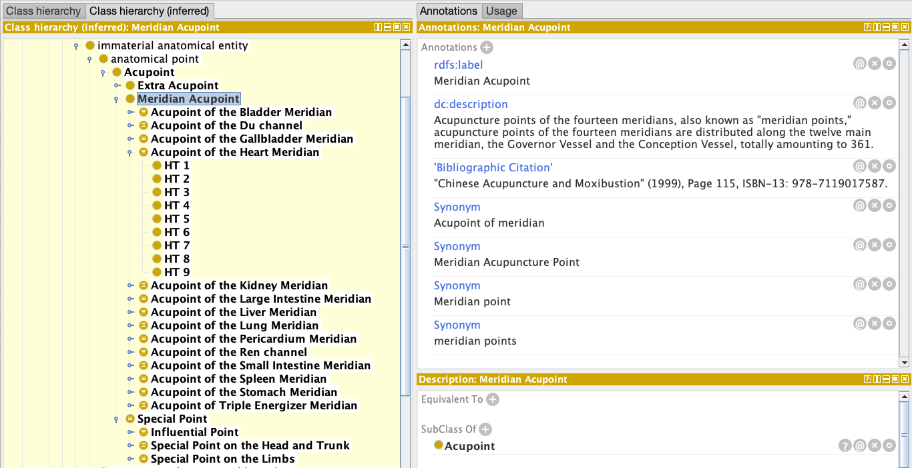
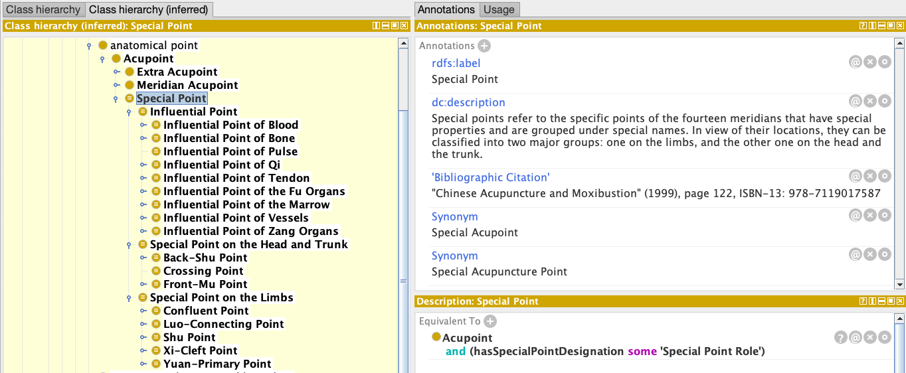
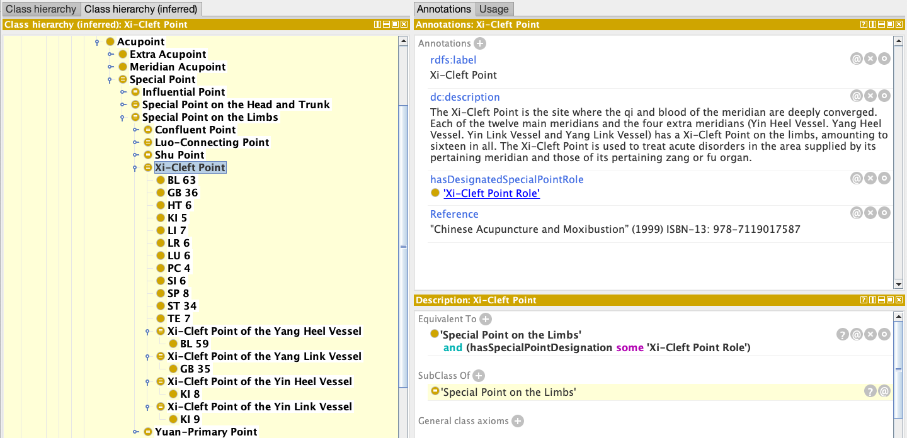
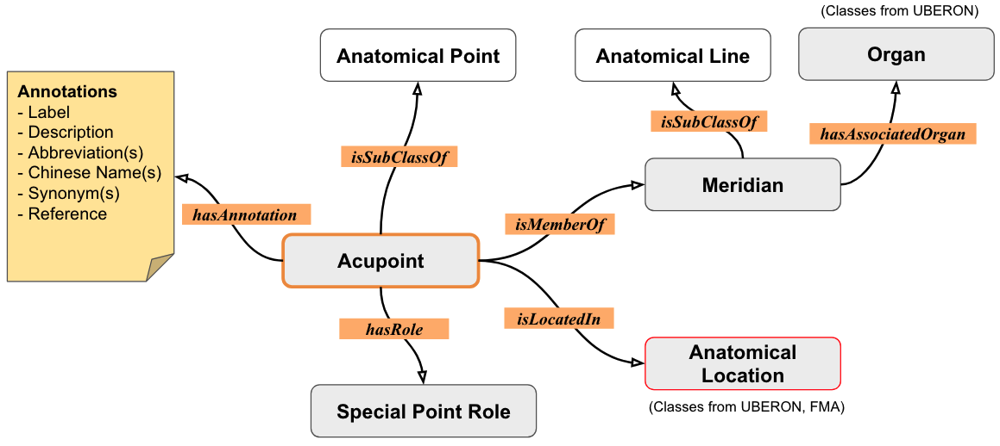
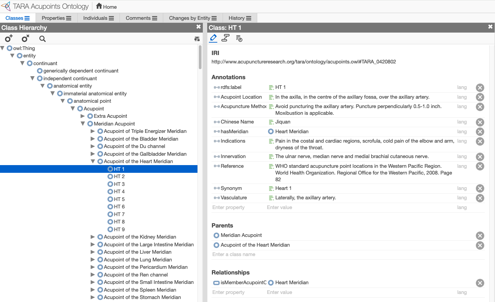

# TARA Acupoints Ontology

This directory contains all ontology files for the [TARA Acupoints Ontology](https://www.acupunctureresearch.org/tara) project. The hand-authored base files live under [`base/`](base/). Generated output files produced by the [ontology generator pipeline](../ontology-generator) are located under [`generated/ttl/`](generated/ttl/). Prior released versions are preserved under [`generated/archived/`](generated/archived/).

For generated file descriptions, version history, and archived releases, see the [Generated Ontology Files readme](generated/readme.md). For the repository structure, quick start, and data sources, see the [repository root readme](../readme.md).

## Contents

1. [About the Ontology](#about-the-ontology)
   - [TARA Acupoints Ontology - Upper Level](#tara-acupoints-ontology---upper-level)
   - [TARA Acupoints Ontology - Core](#tara-acupoints-ontology---core)
   - [Examples of the Basic Hierarchies](#examples-of-the-basic-hierarchies)
   - [Basic Model of Relationships](#basic-model-of-relationships)
     - [Acupoint Annotation Properties](#acupoint-annotation-properties)
     - [TARA Object Properties](#tara-object-properties)
   - [DL Query Examples](#dl-query-examples)
     - [DL Queries Related to Surface Locations](#dl-queries-related-to-surface-locations)
2. [Directory Structure](#directory-structure)
   - [Base Ontology Files](#base-ontology-files)
     - [Imported Terms](#imported-terms)
   - [Generated Ontology Files](#generated-ontology-files)
     - [Ontology Architecture](#ontology-architecture)
3. [Accessing and Exploring the Ontology](#accessing-and-exploring-the-ontology)
   - [Loading the Ontology in Protégé Desktop](#loading-the-ontology-in-protégé-desktop)
   - [Exploring the Ontology in WebProtégé](#exploring-the-ontology-in-webprotégé)
   - [Exploring the Ontology via SPARQL in Stardog](#exploring-the-ontology-via-sparql-in-stardog)
     - [SPARQL Examples in Jupyter Notebook](#sparql-examples-in-jupyter-notebook)

## About the Ontology

The TARA Acupoints Ontology is an OWL-DL ontology developed as part of the [Topological Atlas and Repository for Acupoint Research (TARA)](https://www.acupunctureresearch.org/tara) project, funded by the National Institute of Health (NIH). The goal is to establish a comprehensive, computable resource for the acupuncture research and clinician community. It provides a formal, structured representation of acupuncture point knowledge covering:

- **Acupoints** — classical meridian acupoints and extra acupoints, each assigned a unique numeric TARA identifier (e.g., `TARA:0913913` for LU 1) and annotated with:
  - `rdfs:label` — standard WHO two-part alphanumeric name (e.g., `"LU 1"`)
  - `tara:hasPinyinLabel` — Pinyin transliteration of the Chinese name (e.g., `"Zhongfu"` for LU 1)
  - `tara:hasChineseLabel` — Chinese character name (e.g., `"中府"` for LU 1)
  - `tara:hasSynonym` — alternate names and aliases (e.g., `"Lung 1"`, `"L 1"`, `"Front-Mu Point of the Lung"` for LU 1)
  - `dcterms:bibliographicCitation` — source reference for the acupoint data (WHO Standard Acupuncture Point Locations, Chinese Acupuncture and Moxibustion, etc.)
  - Extra acupoints (e.g., Taiyang / EX-HN 5, Yintang / EX-HN 3) extend the `Extra_Acupoint` class and carry the same annotation properties but are not part of any meridian

- **Meridians** — the 14 meridian channels, each formally defined as an OWL class with a label, Chinese name, abbreviation, and textual description. The 12 primary meridians (LU, LI, ST, SP, HT, SI, BL, KI, PC, TE, GB, LR) plus the two extra meridians (Governor Vessel / Du, Conception Vessel / Ren) are each associated with an organ via `tara:hasAssociatedOrgan` (e.g., Lung Meridian → UBERON:0002048 lung). Acupoints are linked to their meridian by:
  - `tara:hasMeridian` *(annotation)* — textual meridian affiliation (e.g., LU 1 → `"Lung Meridian"`)
  - `tara:isMemberAcupointOf` *(object property)* — structured OWL relation (e.g., LU 1 `isMemberAcupointOf` Lung Meridian)

- **Anatomical locations** — each meridian acupoint is localized at two levels of granularity, linked to controlled vocabulary terms from [UBERON](https://obofoundry.org/ontology/uberon.html) and [InterLex (ILX)](https://interlex.org/):
  - `tara:hasSurfaceLocation` *(annotation)* / `tara:locatedOnTheSurfaceOf` *(object property)* — the general body region on whose surface the acupoint lies (e.g., LU 1 → UBERON:0016416 anterior thoracic region)
  - `tara:hasRelatedLocation` *(annotation)* / `tara:locatedInRelationTo` *(object property)* — one or more specific anatomical structures within that region (e.g., LU 1 → ILX:0795283 first intercostal space, ILX:0795284 infraclavicular fossa, ILX:0795285 anterior median line)
  - `tara:hasLocationalDescription` — canonical WHO textual location description (e.g., `"On the anterior thoracic region, at the same level as the first intercostal space, lateral to the infraclavicular fossa, 6 B-cun lateral to the anterior median line."`)

- **Clinical and physiological annotations** — each acupoint carries a set of annotation properties describing its clinical profile:
  - `tara:hasIndicationsDescription` — TCM clinical indications (e.g., LU 1: `"Cough, asthma, pain in the chest, shoulder and back; fullness of the chest."`)
  - `tara:hasMethodDescription` — needling method, angle, depth, and moxibustion applicability (e.g., LU 1: `"Puncture obliquely 0.5–0.8 cun towards the lateral aspect of the chest … Moxibustion is applicable."`)
  - `tara:hasVasculatureDescription` — blood vessels in the vicinity relevant to safe needling (e.g., LU 1: `"Superolaterally, the axillary artery and vein, the thoracoacromial artery and vein."`)
  - `tara:hasInnervationDescription` — nerve supply in the vicinity (e.g., LU 1: `"The intermediate supraclavicular nerve, the branches of the anterior thoracic nerve, and the lateral cutaneous branch of the first intercostal nerve."`)
  - `tara:hasDesignatedOrgan` — organ designated to be affected per TCM theory (e.g., LU 1 → Lung)

- **Special point categories** — acupoints may hold one or more special point designations drawn from a structured hierarchy of special point roles. Categories include the Five-Shu points (Jing-Well, Ying-Spring, Shu-Stream, Jing-River, He-Sea), Yuan-Primary points, Luo-Connecting points (including Major Luo-Connecting), Xi-Cleft points, Back-Shu points, Front-Mu points, Confluent points, Crossing points, Influential points (of vessels, pulse, bone, blood, marrow, tendon, Zang/Fu organs, Qi), and Lower He-Sea points. Associations are recorded via:
  - `tara:hasDesignatedSpecialPointRole` *(annotation)* — named role as a text annotation (e.g., LU 1 → `"Front-Mu Point of the Lung"`)
  - `tara:hasSpecialPointDesignation` *(object property)* — structured OWL relation linking the acupoint to the corresponding special role class (e.g., LU 1 `hasSpecialPointDesignation` Front-Mu Point of the Lung Role)

- **Pain-related articles** — metadata for pain research articles sourced from the clinical literature, each annotated with the acupoints used and the condition treated. Article metadata is recorded using Dublin Core properties (`dc:title`, `dc:creator`, `dc:date`, `dcterms:bibliographicCitation`, etc.) and linked to standardized disease terms from [MONDO](https://obofoundry.org/ontology/mondo.html) and phenotype terms from [HP](https://obofoundry.org/ontology/hp.html) (e.g., MONDO:0100431 migraine without aura, MONDO:0005416 osteoarthritis of the knee). This data is stored in the separate knowledge base variant (`kb/tara-articles-kb.ttl`).

Closely following the [Open Biomedical Ontology Foundry](https://obofoundry.org/principles/fp-000-summary.html) (OBO Foundry) principles, the TARA Acupoints Ontology is developed to support FAIR principles. These practices include utilizing existing community ontologies where possible and employing upper-level ontologies like [Basic Formal Ontology (BFO)](https://basic-formal-ontology.org/) and [Relation Ontology (RO)](https://obofoundry.org/ontology/ro.html) to ensure maximum interoperability with other biomedical ontologies. The ontology is built on the following upper-level and mid-level ontologies:

| Ontology | Role |
| -------- | ---- |
| [Basic Formal Ontology (BFO)](https://obofoundry.org/ontology/bfo.html) | Top-level formal structure |
| [UBERON](https://obofoundry.org/ontology/uberon.html) | Anatomical entity terms |
| [Relation Ontology (RO)](https://obofoundry.org/ontology/ro.html) | Object properties |
| [Information Artifact Ontology (IAO)](https://github.com/information-artifact-ontology/IAO) | Annotation properties |
| [Dublin Core Metadata (DC)](https://www.dublincore.org/specifications/dublin-core/dcmi-terms/) | Article metadata annotation |
| [MONDO](https://obofoundry.org/ontology/mondo.html), [HP](https://obofoundry.org/ontology/hp.html) | Disease and phenotype terms (imported) |

The ontology incorporates anatomical terms from [UBERON](https://www.ebi.ac.uk/ols4/ontologies/uberon) and [InterLex](https://scicrunch.org/scicrunch/interlex/dashboard) to specify the anatomical locations of acupoints on the body surface. It also incorporates terms from the Mondo Disease Ontology ([MONDO](https://www.ebi.ac.uk/ols4/ontologies/mondo)) and Human Phenotype Ontology ([HP](https://www.ebi.ac.uk/ols4/ontologies/hp)) to specify diseases or conditions studied in relation to acupoint use. These imported terms enable annotation of studied conditions using standardized vocabulary and support higher-level semantic search through the hierarchical structures of the source ontologies.

The ontology takes into account both Eastern and Western nomenclature for acupuncture points. The current scope focuses on the semantic modelling of the anatomical and physiological aspects associated with different acupoints located in the main meridians.

The most recent version of the TARA Acupoints Ontology is also available via BioPortal: [https://bioportal.bioontology.org/ontologies/TARA](https://bioportal.bioontology.org/ontologies/TARA).

### TARA Acupoints Ontology - Upper Level

The upper-level ontology ([`tara-acupoints-upper.ttl`](base/tara-acupoints-upper.ttl)) reuses a subset of the upper-level classes from [UBERON](https://obofoundry.org/ontology/uberon.html) that extend the [Basic Formal Ontology](https://obofoundry.org/ontology/bfo.html) (BFO). It also imports the basic hierarchy of organ terms from UBERON associated with the main meridians of the acupuncture points. It includes the minimal subset of object properties from [Relation Ontology](https://obofoundry.org/ontology/ro.html) (RO Core), and a subset of annotation properties from the [Information Artifact Ontology](https://github.com/information-artifact-ontology/IAO) (IAO) and [Dublin Core Metadata](https://www.dublincore.org/specifications/dublin-core/dcmi-terms/#section-3) (DC).


### TARA Acupoints Ontology - Core

The core ontology ([`tara-acupoints-core.ttl`](base/tara-acupoints-core.ttl)) defines the classes and properties specific to the acupoints domain, together with their logical axioms. It imports the upper ontology and extends the upper-level classes and properties. This file is used as the base by the [ontology generator](../ontology-generator) to generate the full TARA Acupoints Ontology. The Protégé screenshots below show examples of core classes and properties (shown in bold) that are specific to the acupoints ontology and extend the upper-level terms.


The core file defines two top-level property hierarchies specific to TARA:

**`hasAcupointAnnotaionProperty`** — groups all acupoint-specific annotation properties:

| Property | Label | Purpose |
| -------- | ----- | ------- |
| `hasAcupointLocation` | *(grouping)* | Parent of the two location properties below |
| `hasSurfaceLocation` | General Body Region | General body region on whose surface the acupoint lies |
| `hasRelatedLocation` | Specific Body Region | Specific anatomical structures within that region |
| `hasAcupointDescription` | Acupoint Description | Parent of the five textual description properties below |
| `hasLocationalDescription` | Acupuncture Location | Canonical WHO textual location description |
| `hasMethodDescription` | Acupuncture Method | Needling method, angle, depth, moxibustion applicability |
| `hasIndicationsDescription` | Indications | Clinical indications per TCM |
| `hasVasculatureDescription` | Vasculature | Blood vessels relevant to safe needling |
| `hasInnervationDescription` | Innervation | Nerve supply relevant to safe needling |
| `hasDesignatedOrgan` | *(no label)* | Organ designated per TCM meridian affiliation |
| `hasDesignatedSpecialPointRole` | Special Point Role | Named special point role(s) as textual annotation |
| `hasMeridian` | Meridian Membership | Meridian the acupoint belongs to |

**TARA object properties** (9 properties under `owl:ObjectProperty`) include meridian membership (`hasMemberAcupoint` / `isMemberAcupointOf`), special point designation (`hasSpecialPointDesignation` / `isSpecialPointDesignationOf`), surface location (`locatedOnTheSurfaceOf` / `locatedInRelationTo`), and associated organ (`hasAssociatedOrgan`). See the [Basic Model of Relationships](#basic-model-of-relationships) section below for the full reference tables.

### Examples of the Basic Hierarchies

This section provides a set of Protégé screenshot examples of the basic hierarchies used in the TARA Acupoints Ontology.

##### Hierarchy of the Meridians



##### Hierarchy of the Meridian Acupoints



##### Classification of the Special Acupoints



##### Inferred Subclasses of a Special Point

The example shows the inferred subclasses of a special acupuncture point called the "Xi-Cleft Point". The subclasses are the acupoints of different meridians that are considered to be Xi-Cleft points.



### Basic Model of Relationships



The diagram above provides a high-level depiction of possible relationships for Acupoints in the TARA Acupoints Ontology (Version 0.5). It should be noted that not all acupoints require relationships with meridians as there are many acupoints that do not belong to the standard meridian system. Also, not all acupoints have special point designations. Only the acupoints of the 12 main meridians and 2 extra meridians, namely the Governor Vessel and the Conception Vessel, have some special point roles.

#### Acupoint Annotation Properties

The table below lists the 12 sub-properties of `hasAcupointAnnotaionProperty` along with a brief description of each. LU 1 (Zhongfu) is used as the running example.

| Property | Label | Description summary |
| -------- | ----- | ------------------- |
| `hasAcupointLocation` | *(grouping)* | Groups the two location sub-properties below |
| `hasSurfaceLocation` | General Body Region | General body region on whose surface the acupoint is located (e.g., LU 1 → Anterior Thoracic Region) |
| `hasRelatedLocation` | Specific Body Region | Specific anatomical structures within that region (e.g., LU 1 → First Intercostal Space, Infraclavicular Fossa, Anterior Median Line) |
| `hasAcupointDescription` | Acupoint Description | Groups the five textual description sub-properties below |
| `hasLocationalDescription` | Acupuncture Location | Canonical WHO textual location description |
| `hasMethodDescription` | Acupuncture Method | Needling method including angle, depth, and moxibustion applicability |
| `hasIndicationsDescription` | Indications | Clinical indications per TCM |
| `hasVasculatureDescription` | Vasculature | Blood vessels in the vicinity relevant to safe needling |
| `hasInnervationDescription` | Innervation | Nerve supply in the vicinity relevant to safe needling |
| `hasDesignatedOrgan` | *(no label)* | Organ designated to be affected per TCM theory (e.g., LU 1 → Lung) |
| `hasDesignatedSpecialPointRole` | Special Point Role | Named special point role(s) as textual annotation (cross-references `hasSpecialPointDesignation`) |
| `hasMeridian` | Meridian Membership | Meridian the acupoint belongs to (e.g., LU 1 → Lung Meridian) |

#### TARA Object Properties

The table below lists all 9 TARA-specific object properties, their parent RO relation (ID and label), a concrete example, and the `dc:description` from the core ontology file. Inverse properties and SWRL-inferred properties are noted in the description.

| Property | RO parent | RO label | Example | Description |
| -------- | --------- | -------- | ------- | ----------- |
| `hasAssociatedOrgan` | — | — | Lung Meridian → Lung | An object property that relates a meridian to the organ it is associated with according to traditional Chinese medicine theory (e.g., the Lung Meridian is associated with the Lung). Used to express the organ affiliation of a meridian as an OWL axiom. |
| `hasMemberAcupoint` | RO:0002351 | has member | Lung Meridian → LU 1 … LU 11 | An object property that relates a meridian to an acupoint belonging to it (e.g., the Lung Meridian has member acupoints LU 1 through LU 11). It is the inverse of `isMemberAcupointOf` and is a sub-property of the RO relation 'has member' (RO:0002351). |
| `isMemberAcupointOf` | RO:0002350 | member of collection | LU 1 → Lung Meridian | An object property that relates an acupoint to the meridian it belongs to (e.g., LU 1 isMemberAcupointOf Lung Meridian). It is the inverse of `hasMemberAcupoint` and a sub-property of the RO relation 'member of collection' (RO:0002350). |
| `hasSpecialPointDesignation` | RO:0000053 | bearer of | LU 1 → Front-Mu Point of the Lung Role | An object property that relates an acupoint to its designated special acupoint role class (e.g., LU 1 hasSpecialPointDesignation Front-Mu Point of the Lung Role). It is the inverse of `isSpecialPointDesignationOf` and is a sub-property of the RO relation 'bearer of' (RO:0000053). Used in OWL axioms to classify acupoints as special points. |
| `isSpecialPointDesignationOf` | RO:0000052 | inheres in | Front-Mu Point of the Lung Role → LU 1 | An object property that relates a special acupoint role to the acupoint that holds it (e.g., Front-Mu Point of the Lung Role isSpecialPointDesignationOf LU 1). It is the inverse of `hasSpecialPointDesignation` and a sub-property of the RO relation 'inheres in' (RO:0000052). |
| `hasSpecialPointRole` | RO:0000087 | has role | LU 1 → Front-Mu Point of the Lung Role | An object property that relates an acupoint to the special role it bears (e.g., LU 1 hasSpecialPointRole Front-Mu Point of the Lung Role). It is the inverse of `isSpecialPointRoleOf` and a sub-property of the RO relation 'has role' (RO:0000087). This property is inferred via a SWRL rule from `hasSpecialPointDesignation`. |
| `isSpecialPointRoleOf` | RO:0000081 | role of | Front-Mu Point of the Lung Role → LU 1 | An object property that relates a special acupoint role to the acupoint that bears it. It is the inverse of `hasSpecialPointRole` and a sub-property of the RO relation 'role of' (RO:0000081). This property is inferred via a SWRL rule from `isSpecialPointDesignationOf`. |
| `locatedOnTheSurfaceOf` | RO:0001025 | located in | LU 1 → Anterior Thoracic Region | An object property that relates an acupoint to the general body region on whose surface it is located (e.g., LU 1 locatedOnTheSurfaceOf Anterior Thoracic Region). It is a sub-property of the RO relation 'located in' (RO:0001025) and corresponds to the annotation property `hasSurfaceLocation`. |
| `locatedInRelationTo` | RO:0001025 | located in | LU 1 → First Intercostal Space, Infraclavicular Fossa, Anterior Median Line | An object property that relates an acupoint to one or more specific anatomical structures in whose vicinity it is located on the body surface (e.g., LU 1 locatedInRelationTo First Intercostal Space, Infraclavicular Fossa, and Anterior Median Line, all within the Anterior Thoracic Region). It is a sub-property of the RO relation 'located in' (RO:0001025) and corresponds to the annotation property `hasRelatedLocation`. |

### DL Query Examples

The [DL Query tab](https://protegewiki.stanford.edu/wiki/DLQueryTab) in Protégé provides a powerful feature for testing a classified ontology using class expressions in a standard Description Logic (DL) syntax called the Manchester OWL syntax.

- Before using the DL Query tab, make sure to run the reasoner by selecting `Reasoner > Select HermiT > Start reasoner` in Protégé.

This section provides a set of example DL queries to test the basic classifications of the TARA Acupoints Ontology.

**Q: What are the acupuncture points in the Heart Meridian?**

```
'Meridian Acupoint' that isMemberAcupointOf some 'Heart Meridian'
```

Since we have defined a named class called `'Acupoint of the Heart Meridian'` in the ontology that is equivalent to the class expression above, we can achieve the same result by simply typing the named class as the DL Query.

```
'Acupoint of the Heart Meridian' 
```


**Q. What are the Xi-Cleft Points in the main meridians?**

```
'Meridian Acupoint' that hasSpecialPointDesignation some 'Xi-Cleft Point Role'
```

Again, since we have defined a named class called 'Xi-Cleft Point' in the ontology as equivalent to the class expression above, we can achieve the same result by typing `'Meridian Acupoint' and 'Xi-Cleft Point'`.


**Q: What are the Xi-Cleft Points on the Kidney Meridian?**

```
'Xi-Cleft Point' and isMemberAcupointOf some (Meridian 
                 and hasAssociatedOrgan some kidney)
```

We are essentially looking for the Xi-Cleft points in the Kidney Meridian. Since we have a defined class called the 'Acupoint of the Kidney Meridian' as equivalent to `'Meridian Acupoint' and (isMemberAcupointOf some 'Kidney Meridian')` and 'Kidney Meridian' is a subclass of `'Main Meridian' and (hasAssociatedOrgan some kidney)`, we can simply type:

```
'Xi-Cleft Point' and 'Acupoint of the Kidney Meridian'
```


**Q. What are the 8 Confluent Points of the main meridians?**

```
'Confluent Point' and isMemberAcupointOf some 'Main Meridian'
```

Without using the defined class called 'Confluent Point', we would need to use:

```
'Meridian Acupoint' and (hasSpecialPointDesignation some 'Confluent Point Role')
```


**Q. What are the 15 Luo-Connecting Points of the meridians?**

```
'Meridian Acupoint' and 'Luo-Connecting Point'
```

Without using the defined class:

```
'Meridian Acupoint' and hasSpecialPointDesignation some 'Luo-Connecting Point Role'
```


#### DL Queries Related to Surface Locations

**Q. What meridian acupoints can be located on the surface of the face?**

```
'Meridian Acupoint' and (locatedOnTheSurfaceOf some ('part of' some face))
```

**Q. What meridian acupoints can be located on the surface of the chest?**

```
Acupoint and (locatedOnTheSurfaceOf some ('part of' some chest))
```


**Q. What acupoints are located on the surface of the legs?**

```
Acupoint and locatedInRelationTo some ('part of' some leg)
```

**Q: What acupoints are located on the surface of the forearm?**

```
Acupoint and (locatedInRelationTo some ('part of' some 'forelimb zeugopod'))
```

## Directory Structure

| Path | Description |
| ---- | ----------- |
| [`base/`](base/) | Base ontology files (upper level, core, and imported terms) |
| [`base/imported-terms/`](base/imported-terms/) | Imported term sets from external ontologies (UBERON, ILX, MONDO/HP) |
| [`generated/ttl/`](generated/ttl/) | Ontology files generated by the adapter pipeline |
| [`generated/archived/`](generated/archived/) | Archived releases of the ontology (versions 0.5 through 1.0.0) |

### Base Ontology Files

The [`base/`](base/) subdirectory contains the three hand-authored ontology files that serve as the foundation for all generated versions of the TARA Acupoints Ontology:

| File | Description |
| ---- | ----------- |
| [`tara-acupoints-upper.ttl`](base/tara-acupoints-upper.ttl) | Upper-level classes and properties reused from BFO, UBERON, RO, IAO, and Dublin Core |
| [`tara-acupoints-core.ttl`](base/tara-acupoints-core.ttl) | Core classes and properties specific to the TARA Acupoints Ontology |
| [`tara-imported-terms.ttl`](base/tara-imported-terms.ttl) | Aggregated import of external term sets from the `imported-terms/` subdirectory |

#### Imported Terms

The [`base/imported-terms/`](base/imported-terms/) subdirectory contains individual import files that bring in controlled vocabulary from external ontologies. These are aggregated by [`tara-imported-terms.ttl`](base/tara-imported-terms.ttl) for use by the adapter.

| File | Description |
| ---- | ----------- |
| [`tara-uberon-anatomical-terms.ttl`](base/imported-terms/tara-uberon-anatomical-terms.ttl) | Anatomical surface region terms imported from UBERON |
| [`tara-uberon-anatomical-terms-v-0.6.ttl`](base/imported-terms/tara-uberon-anatomical-terms-v-0.6.ttl) | UBERON anatomical terms snapshot used for version 0.6 |
| [`tara-interlex-anatomical-terms.ttl`](base/imported-terms/tara-interlex-anatomical-terms.ttl) | Surface anatomy terms from InterLex (ILX), derived from the Foundational Model of Anatomy (FMA) |
| [`tara_mondo_hp_import.ttl`](base/imported-terms/tara_mondo_hp_import.ttl) | Disease and phenotype terms imported from MONDO and HP for studied conditions |

### Generated Ontology Files
#### Ontology Architecture

The ontology is organized in four layers, each building on the one below it:

```
tara-acupoints-inferred.ttl          (4) Inferred — class hierarchy computed by HermiT
        |
tara-acupoints.ttl                   (3) Merged — main ontology + upper ontology + imported terms
        |
tara-acupoints-temp.ttl              (2) Main — generated from curated CSV files by the adapter
        |
tara-acupoints-core.ttl              (1) Core — hand-authored classes, properties, and axioms
tara-acupoints-upper.ttl                 Upper — subset of BFO/UBERON/RO/IAO/DC terms
tara-imported-terms.ttl                  Imported — MONDO, HP, and other external terms
```

A parallel knowledge base variant (`kb/tara-articles-kb.ttl`, `kb/tara-articles-kb-inferred.ttl`) includes pain-related articles metadata alongside the acupoints ontology.


All generated Turtle files are produced by the [ontology generator pipeline](../ontology-generator) and written to [`generated/ttl/`](generated/ttl/). For the full file descriptions, version history, and archived releases, see the **[Generated Ontology Files readme](generated/readme.md)**.

## Accessing and Exploring the Ontology

The most recent version of the TARA Acupoints Ontology is [linked here](https://raw.githubusercontent.com/smtifahim/TARA-Ontology-Repository/refs/heads/master/ontology-files/generated/ttl/tara-acupoints.ttl). The easiest way to explore the ontology is to load it in **Protégé**. Protégé is a free, open-source ontology editor which you can download from [this link](https://protege.stanford.edu/software.php#desktop-protege).

- The [inferred version of the ontology is linked here](https://raw.githubusercontent.com/smtifahim/TARA-Ontology-Repository/master/ontology-files/generated/ttl/tara-acupoints-inferred.ttl). This inferred ontology merges the asserted and inferred axioms of the acupoints ontology plus the upper ontology into a **single turtle file**.
- The [inferred version of the ontology PLUS the articles knowledge base is linked here](https://raw.githubusercontent.com/smtifahim/TARA-Ontology-Repository/refs/heads/master/ontology-files/generated/ttl/kb/tara-articles-kb-inferred.ttl). This inferred ontology merges the asserted and inferred axioms of the acupoints ontology, the upper ontology, plus the annotated articles metadata into a **single turtle file**.

### Loading the Ontology in Protégé Desktop

- Make sure to download the Protégé Desktop Version 5.5.X or higher. If you are not familiar with the Protégé interface there is a "Getting Started" document [linked here](https://protegeproject.github.io/protege/getting-started/).
- Click `File > Open From URL..` in Protégé and copy/paste the [**TARA Acupoints Ontology Link**](https://raw.githubusercontent.com/smtifahim/TARA-Ontology-Repository/refs/heads/master/ontology-files/generated/ttl/tara-acupoints.ttl) under the `URI` field. Clicking the `OK` button will load the ontology in Protégé.


The screenshot above is from TARA Acupoints Ontology - Version 0.5.

### Exploring the Ontology in WebProtégé

The inferred version of the TARA Acupoints Ontology is available to explore via **WebProtégé**. WebProtégé is an open source, lightweight, web-based ontology viewer and editor. The ontology is available in WebProtégé *only for viewing and commenting*. The idea is to gather feedback from acupoint experts.

- If you don't have an account in WebProtégé, [create an account using this link](https://webprotege.stanford.edu/).
- Simply navigate to the following link: [TARA Acupoints Ontology in WebProtégé](https://webprotege.stanford.edu/#projects/3be98cb1-fa54-4ddd-a5e8-a9803783b90d/edit/Classes?selection=Class(%3Chttp://www.acupunctureresearch.org/tara/ontology/TARA_1132428%3E))
- If you are new to WebProtégé, please visit the [WebProtégé User Guide](https://protegewiki.stanford.edu/wiki/WebProtegeUsersGuide).



### Exploring the Ontology via SPARQL in Stardog

#### SPARQL Examples in Jupyter Notebook

A set of [example queries are available in a Jupyter Notebook](https://github.com/smtifahim/TARA-Ontology-Repository/blob/master/sparql/tara-sparql-queries.ipynb) to explore the TARA Acupoints Ontology. Sample query result files are stored under [`../sparql/sparql-results/`](../sparql/sparql-results/).

**Q. List all the acupoints along with their meridians, special point role, and surface regions.**

```SPARQL
PREFIX rdf: <http://www.w3.org/1999/02/22-rdf-syntax-ns#>
PREFIX owl: <http://www.w3.org/2002/07/owl#>
PREFIX rdfs: <http://www.w3.org/2000/01/rdf-schema#>
PREFIX xsd: <http://www.w3.org/2001/XMLSchema#>
PREFIX TARA: <http://www.acupunctureresearch.org/tara/ontology/>

SELECT DISTINCT ?acupoint_iri ?acupoint ?meridian ?special_point_role ?surface_region
WHERE 
{
    ?acupoint_iri TARA:hasMeridian/rdfs:label ?meridian.
    ?acupoint_iri rdfs:subClassOf/rdfs:label "Meridian Acupoint".
    OPTIONAL { ?acupoint_iri TARA:hasDesignatedSpecialPointRole/rdfs:label ?special_point_role. }
    OPTIONAL 
    {   
        ?acupoint_iri TARA:hasSurfaceLocation ?surface_region_iri.
        ?surface_region_iri rdfs:label ?surface_region.
    }
    FILTER (!regex(str(?acupoint), 'Acupoint of the'))
    ?acupoint_iri rdfs:label ?acupoint.
}
ORDER BY ?meridian ?acupoint
LIMIT 1000
```

**Q. What surface regions are associated with a particular acupoint (e.g., LU 9)?**

```SPARQL
PREFIX rdf: <http://www.w3.org/1999/02/22-rdf-syntax-ns#>
PREFIX owl: <http://www.w3.org/2002/07/owl#>
PREFIX rdfs: <http://www.w3.org/2000/01/rdf-schema#>
PREFIX xsd: <http://www.w3.org/2001/XMLSchema#>
PREFIX TARA: <http://www.acupunctureresearch.org/tara/ontology/>

SELECT ?acupoint ?related_region ?related_region_iri ?surface_region ?surface_region_iri
WHERE 
{
    FILTER (?acupoint = 'LU 9'). 
    ?acupoint_iri TARA:hasRelatedLocation ?related_region_iri.
    ?acupoint_iri TARA:hasSurfaceLocation ?surface_region_iri.
    ?acupoint_iri rdfs:label ?acupoint.
    ?surface_region_iri rdfs:label ?surface_region.
    ?related_region_iri rdfs:label ?related_region.
}
ORDER BY ?acupoint
LIMIT 10
```

**Query Result:**

| acupoint | related_region | related_region_iri | surface_region | surface_region_iri |
| -------- | -------------- | ------------------ | -------------- | ------------------ |
| LU 9 | abductor pollicis longus tendon | ILX:0795335 | carpal region | UBERON:0004452 |
| LU 9 | carpal region | UBERON:0004452 | carpal region | UBERON:0004452 |
| LU 9 | palmar wrist crease | ILX:0795334 | carpal region | UBERON:0004452 |
| LU 9 | radiale | UBERON:0001427 | carpal region | UBERON:0004452 |
| LU 9 | styloid process of radius | UBERON:7500078 | carpal region | UBERON:0004452 |
| LU 9 | radial artery | UBERON:0001404 | carpal region | UBERON:0004452 |

**Q. What surface regions are connected by a given meridian (e.g., Lung Meridian)?**

```SPARQL
PREFIX rdf: <http://www.w3.org/1999/02/22-rdf-syntax-ns#>
PREFIX owl: <http://www.w3.org/2002/07/owl#>
PREFIX rdfs: <http://www.w3.org/2000/01/rdf-schema#>
PREFIX xsd: <http://www.w3.org/2001/XMLSchema#>
PREFIX TARA: <http://www.acupunctureresearch.org/tara/ontology/>

SELECT DISTINCT 
    ?meridian ?acupoint
    ?surface_region ?surface_region_iri
    ?related_region ?related_region_iri 
WHERE 
{
    FILTER (?meridian = 'Lung Meridian'). 
    ?acupoint_iri TARA:hasMeridian ?meridian_iri.
    ?acupoint_iri TARA:hasRelatedLocation ?related_region_iri.
    ?acupoint_iri TARA:hasSurfaceLocation ?surface_region_iri.
    ?acupoint_iri rdfs:label ?acupoint.
    ?meridian_iri rdfs:label ?meridian.
    ?surface_region_iri rdfs:label ?surface_region.
    ?related_region_iri rdfs:label ?related_region.
    FILTER (?related_region != ?surface_region)
}
ORDER BY ?meridian ?acupoint ?surface_region ?related_region
LIMIT 30
```

**Additional example queries will be added based on the use cases of the TARA ontology as part of this section.**
