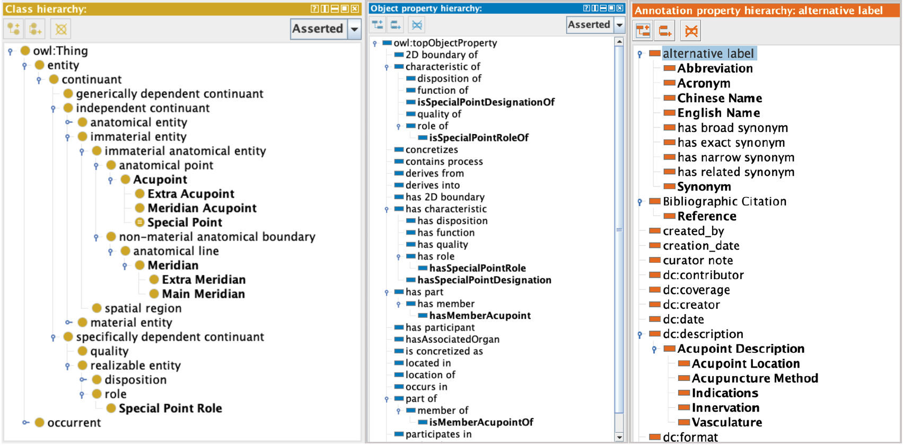

# TARA Ontology Files

This directory contains all ontology files associated with the TARA Acupoints Ontology project. The hand-authored base ontology files are located under the [`base/`](base/) subdirectory. Generated output files produced by the [ontology adapter pipeline](../csv-adapter) are located under [`generated/ttl/`](generated/ttl/). Prior released versions are preserved under [`archived/`](archived/).

## Directory Structure

| Path                                           | Description                                                         |
| ---------------------------------------------- | ------------------------------------------------------------------- |
| [`base/`](base/)                               | Base ontology files (upper level, core, and imported terms)         |
| [`base/imported-terms/`](base/imported-terms/) | Imported term sets from external ontologies (UBERON, ILX, MONDO/HP) |
| [`generated/ttl/`](generated/ttl/)             | Ontology files generated by the adapter pipeline                    |
| [`archived/`](archived/)                       | Archived releases of the ontology (versions 0.5 through 1.0.0)      |
| [`sparql-results/`](sparql-results/)           | Sample SPARQL query result files                                    |

## Contents

1. [Base Ontology Files](#base-ontology-files)
   - [Upper Level](#tara-acupoints-ontology---upper-level)
   - [Core](#tara-acupoints-ontology---core)
   - [Imported Terms](#imported-terms)
2. [Generated Ontology Files](#generated-ontology-files)
3. [Archived Versions](#archived-versions)
4. [SPARQL Query Examples](#sparql-query-examples)

## Base Ontology Files

The [`base/`](base/) subdirectory contains the three hand-authored ontology files that serve as the foundation for all generated versions of the TARA Acupoints Ontology:

| File                                                        | Description                                                                          |
| ----------------------------------------------------------- | ------------------------------------------------------------------------------------ |
| [`tara-acupoints-upper.ttl`](base/tara-acupoints-upper.ttl) | Upper-level classes and properties reused from BFO, UBERON, RO, IAO, and Dublin Core |
| [`tara-acupoints-core.ttl`](base/tara-acupoints-core.ttl)   | Core classes and properties specific to the TARA Acupoints Ontology                  |
| [`tara-imported-terms.ttl`](base/tara-imported-terms.ttl)   | Aggregated import of external term sets from the`imported-terms/` subdirectory       |

### TARA Acupoints Ontology - Upper Level

The upper-level ontology ([`tara-acupoints-upper.ttl`](base/tara-acupoints-upper.ttl)) reuses a subset of the upper-level classes from [UBERON](https://obofoundry.org/ontology/uberon.html) that extend the [Basic Formal Ontology](https://obofoundry.org/ontology/bfo.html) (BFO). It also imports the basic hierarchy of organ terms from UBERON associated with the main meridians of the acupuncture points. It includes the minimal subset of object properties from [Relation Ontology](https://obofoundry.org/ontology/ro.html) (RO Core), and a subset of annotation properties from the [Information Artifact Ontology](https://github.com/information-artifact-ontology/IAO) (IAO) and [Dublin Core Metadata](https://www.dublincore.org/specifications/dublin-core/dcmi-terms/#section-3) (DC).

### TARA Acupoints Ontology - Core

The core ontology ([`tara-acupoints-core.ttl`](base/tara-acupoints-core.ttl)) defines the classes and properties specific to the acupoints domain, together with their logical axioms. It imports the upper ontology and extends the upper-level classes and properties. This file is used as the base by the [ontology adapter](../csv-adapter) to generate the full TARA Acupoints Ontology. The Protege screenshots below show examples of core classes and properties (shown in bold) that are specific to the acupoints ontology and extend the upper-level terms.

### Imported Terms

The [`base/imported-terms/`](base/imported-terms/) subdirectory contains individual import files that bring in controlled vocabulary from external ontologies. These are aggregated by [`tara-imported-terms.ttl`](base/tara-imported-terms.ttl) for use by the adapter.

| File                                                                                                   | Description                                                                                     |
| ------------------------------------------------------------------------------------------------------ | ----------------------------------------------------------------------------------------------- |
| [`tara-uberon-anatomical-terms.ttl`](base/imported-terms/tara-uberon-anatomical-terms.ttl)             | Anatomical surface region terms imported from UBERON                                            |
| [`tara-uberon-anatomical-terms-v-0.6.ttl`](base/imported-terms/tara-uberon-anatomical-terms-v-0.6.ttl) | UBERON anatomical terms snapshot used for version 0.6                                           |
| [`tara-interlex-anatomical-terms.ttl`](base/imported-terms/tara-interlex-anatomical-terms.ttl)         | Surface anatomy terms from InterLex (ILX), derived from the Foundational Model of Anatomy (FMA) |
| [`tara_mondo_hp_import.ttl`](base/imported-terms/tara_mondo_hp_import.ttl)                             | Disease and phenotype terms imported from MONDO and HP for studied conditions                   |

## Generated Ontology Files

The [`generated/ttl/`](generated/ttl/) subdirectory contains the ontology files produced by the [adapter pipeline](../csv-adapter). For a full description of each file, version history, query examples, and loading instructions, see the [Generated Ontology Files page](generated/readme.md).

| File                                                                                           | Description                                                      |
| ---------------------------------------------------------------------------------------------- | ---------------------------------------------------------------- |
| [`tara-acupoints.ttl`](generated/ttl/tara-acupoints.ttl)                                       | Main ontology generated from CSV files                           |
| [`tara-articles.ttl`](generated/ttl/tara-articles.ttl)                                         | Articles metadata ontology                                       |
| [`tara-acupoints-merged.ttl`](generated/ttl/tara-acupoints-merged.ttl)                         | Main ontology merged with upper ontology and imported terms      |
| [`tara-acupoints-articles-kb-merged.ttl`](generated/ttl/tara-acupoints-articles-kb-merged.ttl) | Merged ontology plus articles (knowledge base variant)           |
| [`tara-acupoints-inferred.ttl`](generated/ttl/tara-acupoints-inferred.ttl)                     | Merged ontology with inferred class hierarchy from HermiT        |
| [`tara-acupoints-kb-inferred.ttl`](generated/ttl/tara-acupoints-kb-inferred.ttl)               | Knowledge base variant with inferred class hierarchy from HermiT |

## Archived Versions

The [`archived/`](archived/) subdirectory preserves prior released versions of the ontology for reference and reproducibility.

| Version | Directory                                            |
| ------- | ---------------------------------------------------- |
| 0.5     | [`archived/version-0.5/`](archived/version-0.5/)     |
| 0.5.1   | [`archived/version-0.5.1/`](archived/version-0.5.1/) |
| 0.7     | [`archived/version-0.7/`](archived/version-0.7/)     |
| 0.7.1   | [`archived/version-0.7.1/`](archived/version-0.7.1/) |
| 1.0.0   | [`archived/version-1.0.0/`](archived/version-1.0.0/) |

## SPARQL Query Examples

The [`sparql-results/`](sparql-results/) directory contains sample output files from queries run against the ontology. A full set of example SPARQL queries with explanations is available in the [TARA SPARQL Query Examples notebook](TARA%20SPARQL%20Query%20Examples.ipynb), also viewable [on GitHub](https://github.com/smtifahim/TARA-Ontology-Repository/blob/master/ontology-files/TARA%20SPARQL%20Query%20Examples.ipynb). Additional DL and SPARQL query examples are documented on the [Generated Ontology Files page](generated/readme.md#sparql-query-examples).
