# TARA Acupoints Ontology Project Repository

This repository contains the source files, curated data, and generation pipeline for the TARA Acupoints Ontology. The ontology project is part of the [Topological Atlas and Repository for Acupoint Research (TARA)](https://www.acupunctureresearch.org/tara) project funded by the National Institute of Health (NIH). The goal of the project is to establish a new comprehensive, computable resource for the acupuncture research and clinician community. The ontology will be used to support semantic search and annotations for anatomical maps, atlases, and data sets relevant to the TARA project.

* [Accessing and Exploring TARA Ontology](#accessing-and-exploring-tara-ontology)
* [TARA Acupoints Ontology : An Overview](#tara-acupoints-ontology--an-overview)
* [TARA Ontology - Knowledge Curation Sources](#tara-ontology---knowledge-curation-sources)
* [TARA Acupoints Ontology: Versions Summary](#tara-ontology-versions-summary)

## Contents

1. [TARA Ontology Project Repository Structure](#tara-ontology-project-repository-structure)
2. [TARA Acupoints Ontology : An Overview](#tara-acupoints-ontology--an-overview)
   - [TARA Ontology - Introduction](#tara-ontology---introduction)
   - [TARA Ontology - Knowledge Curation Sources](#tara-ontology---knowledge-curation-sources)
   - [TARA Ontology - Upper Level](#tara-ontology---upper-level)
   - [TARA Ontology - Core Entities](#tara-ontology---core-entities)
     - [TARA Ontology - Basic Relationships Model](#tara-ontology---basic-relationships-model)
     - [TARA Acupoints Annotation Properties](#tara-acupoints-annotation-properties)
     - [TARA Acupoints Object Properties](#tara-acupoints-object-properties)
   - [TARA Ontology - Example Hierarchies](#tara-ontology---example-hierarchies)
     - [Hierarchy of the Meridians](#hierarchy-of-the-meridians)
     - [Hierarchy of the Meridian Acupoints](#hierarchy-of-the-meridian-acupoints)
     - [Classification of the Special Acupoints](#classification-of-the-special-acupoints)
     - [Inferred Special Points Classification of Acupoints](#inferred-special-points-classification-of-acupoints)
   - [TARA Ontology - DL Query Examples](#tara-ontology---dl-query-examples)
     - [DL Queries on Acupoints of the Meridians](#dl-queries-on-acupoints-of-the-meridians)
     - [DL Queries on Acupoints with Special Point Roles](#dl-queries-on-acupoints-with-special-point-roles)
     - [DL Queries Related to Acupoints Locations](#dl-queries-related-to-acupoints-locations)
3. [Accessing and Exploring TARA Ontology](#accessing-and-exploring-tara-ontology)
   - [Accessing TARA Ontology Files](#accessing-tara-ontology-files)
   - [Loading TARA Ontology in Protégé Desktop](#loading-tara-ontology-in-protégé-desktop)
   - [Exploring TARA Ontology in WebProtégé](#exploring-tara-ontology-in-webprotégé)
   - [Exploring TARA Ontology in NCBO BioPortal](#exploring-tara-ontology-in-ncbo-bioportal)
   - [Exploring TARA Ontology via SPARQL in Stardog](#exploring-tara-ontology-via-sparql-in-stardog)
     - [SPARQL Query Examples](#sparql-query-examples)
4. [Quick Useful Links](#quick-useful-links)
   - [TARA Ontology: Versions Summary](#tara-ontology-versions-summary)
   - [TARA Ontology: Archived Versions](#tara-ontology-archived-versions)

## TARA Ontology Project Repository Structure


| Directory                                  | Description                                                                                                                                                                                                                                                                                                       |
| ------------------------------------------ | ----------------------------------------------------------------------------------------------------------------------------------------------------------------------------------------------------------------------------------------------------------------------------------------------------------------- |
| [ontology-generator](./ontology-generator) | Python scripts for generating the ontology from curated data files. See the[generator readme](./ontology-generator/readme.md) for the full pipeline description, prerequisites, and sample output.                                                                                                                |
| [curated-data](./curated-data)             | Curated CSV files that serve as the input data for the generator. Sourced from the TARA Ontology Curation Google Sheet. See the[curated data readme](./curated-data/readme.md).                                                                                                                                   |
| [ontology-files](./ontology-files)         | Base ontology files (under[`base/`](./ontology-files/base/)), generated output files (under [`generated/ttl/`](./ontology-files/generated/ttl/)), and archived prior versions (under [`generated/archived/`](./ontology-files/generated/archived/)). See the [ontology files readme](./ontology-files/readme.md). |
| [sparql](./sparql)                         | SPARQL query notebook ([`tara-sparql-queries.ipynb`](./sparql/tara-sparql-queries.ipynb)) and sample query result files.                                                                                                                                                                                          |
| [downstream](./downstream)                 | Data extraction pipelines for external groups and projects that consume the TARA Acupoints Ontology. Each subdirectory contains scripts and generated data for a specific downstream consumer. See the[downstream readme](./downstream/readme.md).                                                                |

## TARA Acupoints Ontology : An Overview

### TARA Ontology - Introduction

The TARA Acupoints Ontology is an OWL-DL ontology developed as part of the [Topological Atlas and Repository for Acupoint Research (TARA)](https://www.acupunctureresearch.org/tara) project, funded by the National Institute of Health (NIH). The goal is to establish a comprehensive, computable resource for the acupuncture research and clinician community. It provides a formal, structured representation of acupuncture point knowledge covering:


| Knowledge Domain                         | Description                                                                                                                                                                                                                                                                                                                                                                                                                                                                                                                                                                        |
| ---------------------------------------- | ---------------------------------------------------------------------------------------------------------------------------------------------------------------------------------------------------------------------------------------------------------------------------------------------------------------------------------------------------------------------------------------------------------------------------------------------------------------------------------------------------------------------------------------------------------------------------------- |
| **Acupoints**                            | Total 371 meridian acupoints and 43 extra acupoints. The ontology includes 361 classical ones plus 5 sex-specific acupoints making the total 371. These specific acupoints are ST 17, ST 18, GB 24, LR 14, CV 1, each having male and female specific subclasses. Each acupoint is assigned a unique numeric TARA identifier (e.g.,`TARA:0913913` for LU 1). Extra acupoints (e.g., Taiyang / EX-HN 5, Yintang / EX-HN 3) extend the `Extra_Acupoint` class and carry the same annotation properties but are not part of any meridian. See *Acupoint Annotation Properties* below. |
| **Meridians**                            | The 14 meridian channels, each formally defined as an OWL class with a label, Chinese name, abbreviation, and textual description. The 12 primary meridians (LU, LI, ST, SP, HT, SI, BL, KI, PC, TE, GB, LR) plus the two extra meridians (Governor Vessel / Du, Conception Vessel / Ren) are each associated with an organ via`tara:hasAssociatedOrgan` (e.g., Lung Meridian → UBERON:0002048 lung). See *Meridian Linking Properties* below.                                                                                                                                    |
| **Anatomical Locations**                 | Each meridian acupoint is localized at two levels of granularity, linked to controlled vocabulary terms from[UBERON](https://obofoundry.org/ontology/uberon.html) and [InterLex (ILX)](https://interlex.org/). See *Anatomical Location Properties* below.                                                                                                                                                                                                                                                                                                                         |
| **Clinical & Physiological Annotations** | Each acupoint carries a set of annotation properties describing its clinical profile (indications, needling method, vasculature, innervation, and designated organ). See*Clinical and Physiological Annotation Properties* below.                                                                                                                                                                                                                                                                                                                                                  |
| **Special Point Categories**             | Acupoints may hold one or more special point designations from a structured hierarchy including Five-Shu points (Jing-Well, Ying-Spring, Shu-Stream, Jing-River, He-Sea), Yuan-Primary, Luo-Connecting (incl. Major Luo-Connecting), Xi-Cleft, Back-Shu, Front-Mu, Confluent, Crossing, Influential (of vessels, pulse, bone, blood, marrow, tendon, Zang/Fu organs, Qi), and Lower He-Sea points. See*Special Point Association Properties* below.                                                                                                                                |
| **Pain-Related Articles**                | Metadata for pain research articles annotated with acupoints and conditions treated, using Dublin Core properties (`dc:title`, `dc:creator`, `dc:date`, `dcterms:bibliographicCitation`, etc.) and linked to [MONDO](https://obofoundry.org/ontology/mondo.html) and [HP](https://obofoundry.org/ontology/hp.html) terms (e.g., MONDO:0100431 migraine without aura, MONDO:0005416 osteoarthritis of the knee). Stored in `kb/tara-articles-kb.ttl`.                                                                                                                               |

**Acupoint Annotation Properties**


| Property                        | Description                                | Example (LU 1)                                                                      |
| ------------------------------- | ------------------------------------------ | ----------------------------------------------------------------------------------- |
| `rdfs:label`                    | Standard WHO two-part alphanumeric name    | `"LU 1"`                                                                            |
| `tara:hasPinyinLabel`           | Pinyin transliteration of the Chinese name | `"Zhongfu"`                                                                         |
| `tara:hasChineseLabel`          | Chinese character name                     | `"中府"`                                                                            |
| `tara:hasSynonym`               | Alternate names and aliases                | `"Lung 1"`, `"L 1"`, `"Front-Mu Point of the Lung"`                                 |
| `dcterms:bibliographicCitation` | Source reference for the acupoint data     | WHO Standard Acupuncture Point Locations, Chinese Acupuncture and Moxibustion, etc. |

**Meridian Linking Properties**


| Property                      | Type            | Description                 | Example                                         |
| ----------------------------- | --------------- | --------------------------- | ----------------------------------------------- |
| `tara:isLocatedOnMeridian`    | annotation      | meridian class affiliation | LU 1 →`Lung Meridian`                          |
| `tara-op:isLocatedOnMeridian` | object property | Structured OWL relation     | LU 1`→`isMemberAcupointOf`some`'Lung Meridian' |

**Anatomical Location Properties**


| Property                                                 | Type                         | Description                                                   | Example (LU 1)                                                                                                                                                            |
| -------------------------------------------------------- | ---------------------------- | ------------------------------------------------------------- | ------------------------------------------------------------------------------------------------------------------------------------------------------------------------- |
| `tara:hasSurfaceLocation` / `tara:locatedOnTheSurfaceOf` | annotation / object property | General body region on whose surface the acupoint lies        | UBERON:0016416 anterior thoracic region                                                                                                                                   |
| `tara:hasRelatedLocation` / `tara:locatedInRelationTo`   | annotation / object property | One or more specific anatomical structures within that region | ILX:0795283 first intercostal space, ILX:0795284 infraclavicular fossa, ILX:0795285 anterior median line                                                                  |
| `tara:hasLocationalDescription`                          | annotation                   | Canonical WHO textual location description                    | `"On the anterior thoracic region, at the same level as the first intercostal space, lateral to the infraclavicular fossa, 6 B-cun lateral to the anterior median line."` |

**Clinical and Physiological Annotation Properties**


| Property                         | Description                                                  | Example (LU 1)                                                                                                                                            |
| -------------------------------- | ------------------------------------------------------------ | --------------------------------------------------------------------------------------------------------------------------------------------------------- |
| `tara:hasIndicationsDescription` | TCM clinical indications                                     | `"Cough, asthma, pain in the chest, shoulder and back; fullness of the chest."`                                                                           |
| `tara:hasMethodDescription`      | Needling method, angle, depth, and moxibustion applicability | `"Puncture obliquely 0.5–0.8 cun towards the lateral aspect of the chest … Moxibustion is applicable."`                                                 |
| `tara:hasVasculatureDescription` | Blood vessels in the vicinity relevant to safe needling      | `"Superolaterally, the axillary artery and vein, the thoracoacromial artery and vein."`                                                                   |
| `tara:hasInnervationDescription` | Nerve supply in the vicinity relevant to safe needling       | `"The intermediate supraclavicular nerve, the branches of the anterior thoracic nerve, and the lateral cutaneous branch of the first intercostal nerve."` |
| `tara:hasDesignatedOrgan`        | Organ designated to be affected per TCM theory               | Lung                                                                                                                                                      |

**Special Point Association Properties**


| Property                             | Type            | Description                                                                          | Example (LU 1)                                                   |
| ------------------------------------ | --------------- | ------------------------------------------------------------------------------------ | ---------------------------------------------------------------- |
| `tara:hasDesignatedSpecialPointRole` | annotation      | Named role as a text annotation                                                      | `"Front-Mu Point of the Lung"`                                   |
| `tara:hasSpecialPointDesignation`    | object property | Structured OWL relation linking the acupoint to the corresponding special role class | LU 1`hasSpecialPointDesignation` Front-Mu Point of the Lung Role |

Closely following the [Open Biomedical Ontology Foundry](https://obofoundry.org/principles/fp-000-summary.html) (OBO Foundry) principles, the TARA Acupoints Ontology is developed to support FAIR principles. These practices include utilizing existing community ontologies where possible and employing upper-level ontologies like [Basic Formal Ontology (BFO)](https://basic-formal-ontology.org/) and [Relation Ontology (RO)](https://obofoundry.org/ontology/ro.html) to ensure maximum interoperability with other biomedical ontologies. The ontology is built on the following upper-level and mid-level ontologies:


| Ontology                                                                                           | Role                                   |
| -------------------------------------------------------------------------------------------------- | -------------------------------------- |
| [Basic Formal Ontology (BFO)](https://obofoundry.org/ontology/bfo.html)                            | Top-level formal structure             |
| [UBERON](https://obofoundry.org/ontology/uberon.html)                                              | Anatomical entity terms                |
| [Relation Ontology (RO)](https://obofoundry.org/ontology/ro.html)                                  | Object properties                      |
| [Information Artifact Ontology (IAO)](https://github.com/information-artifact-ontology/IAO)        | Annotation properties                  |
| [Dublin Core Metadata (DC)](https://www.dublincore.org/specifications/dublin-core/dcmi-terms/)     | Article metadata annotation            |
| [MONDO](https://obofoundry.org/ontology/mondo.html), [HP](https://obofoundry.org/ontology/hp.html) | Disease and phenotype terms (imported) |

The ontology incorporates anatomical terms from [UBERON](https://www.ebi.ac.uk/ols4/ontologies/uberon) and [InterLex](https://scicrunch.org/scicrunch/interlex/dashboard) to specify the anatomical locations of acupoints on the body surface. It also incorporates terms from the Mondo Disease Ontology ([MONDO](https://www.ebi.ac.uk/ols4/ontologies/mondo)) and Human Phenotype Ontology ([HP](https://www.ebi.ac.uk/ols4/ontologies/hp)) to specify diseases or conditions studied in relation to acupoint use. These imported terms enable annotation of studied conditions using standardized vocabulary and support higher-level semantic search through the hierarchical structures of the source ontologies.

The ontology takes into account both Eastern and Western nomenclature for acupuncture points. The current scope focuses on the semantic modelling of the anatomical and physiological aspects associated with different acupoints located on the main meridians.

### TARA Ontology - Knowledge Curation Sources

The knowledge curated for the TARA Acupoints Ontology is drawn primarily from the following authoritative reference sources:

- *WHO Standard Acupuncture Point Locations in the Western Pacific Region*. World Health Organization (WHO). WHO Regional Office for the Western Pacific, 2008. ISBN 978-92-9061-248-7. [Available online](https://iris.who.int/handle/10665/353407).

  - Source for standardized alphanumeric codes, phonetic Pinyin spellings, names using traditional Chinese characters for standard acupoints, along with their surface-anatomy locations on the human body.
- *Chinese Acupuncture and Moxibustion*. Edited by C. Xinnong. Revised ed. Foreign Languages Press, Beijing, China, 1999. ISBN 978-7-119-01758-7.

  * Source for Acupuncture Method, Vasculature, Innervation, and Indications.
  * Source for Extra Acupoints, including their standardized Pinyin spellings, synonymous alphanumeric codes, and surface-anatomy location on the human body.
  * Source for the standard nomenclature and classification of Special Points, as well as the classification schema for standard acupoints based on their Special Point roles.
- *Acupuncture: A Comprehensive Text*. Shanghai College of Traditional Medicine. Chapter 8: Other New and Miscellaneous Acupuncture. Translated and edited by J. O'Connor and D. Bensky. Chicago: Eastland Press, 1981.

  - Source for alternative, commonly used alphanumeric codes for Extra Acupoints included in the  TARA Ontology.
- [Uberon Multi-Species Anatomy Ontology](https://obofoundry.org/ontology/uberon.html). An integrated cross-species anatomy ontology covering animals and bridging multiple species-specific ontologies.

  - Source for standard mappings of anatomical entities used in the TARA Ontology, including body-surface regions (e.g., specific regions on the head, chest, and torso) and subsurface anatomical structures (e.g., nerves, veins, and arteries) associated with acupoints based on their descriptions in standards sources.
- Mondo Disease Ontology ([MONDO](https://www.ebi.ac.uk/ols4/ontologies/mondo)) and Human Phenotype Ontology ([HP](https://www.ebi.ac.uk/ols4/ontologies/hp)).

  - Source for standardized mappings of diseases and conditions identified in the scientific literature related to acupoints. These mappings are currently being applied to article metadata curated as part of the TARA Articles Knowledgebase project.

### TARA Ontology - Upper Level

The upper-level ontology ([`tara-acupoints-upper.ttl`](ontology-files/base/tara-acupoints-upper.ttl)) reuses a subset of the upper-level classes from [UBERON](https://obofoundry.org/ontology/uberon.html) that extend the [Basic Formal Ontology](https://obofoundry.org/ontology/bfo.html) (BFO). It also imports the basic hierarchy of organ terms from UBERON associated with the main meridians of the acupuncture points. It includes the minimal subset of object properties from [Relation Ontology](https://obofoundry.org/ontology/ro.html) (RO Core), and a subset of annotation properties from the [Information Artifact Ontology](https://github.com/information-artifact-ontology/IAO) (IAO) and [Dublin Core Metadata](https://www.dublincore.org/specifications/dublin-core/dcmi-terms/#section-3) (DC).

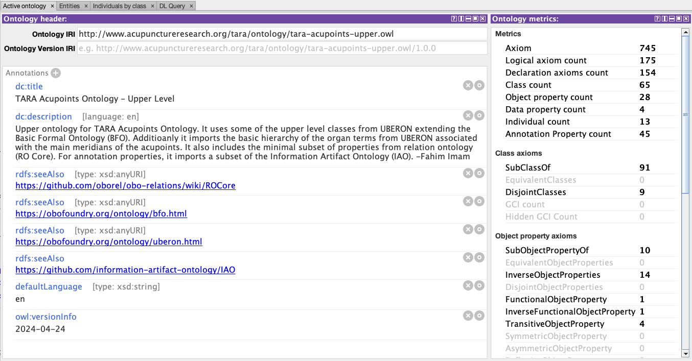

### TARA Ontology - Core Entities

The core ontology ([`tara-acupoints-core.ttl`](ontology-files/base/tara-acupoints-core.ttl)) defines the classes and properties specific to the acupoints domain, together with their logical axioms. It imports the upper ontology and extends the upper-level classes and properties. This file is used as the base by the [ontology generator](./ontology-generator) to generate the full TARA Acupoints Ontology. The Protégé screenshots below show examples of core classes and properties (shown in bold) that are specific to the acupoints ontology and extend the upper-level terms.

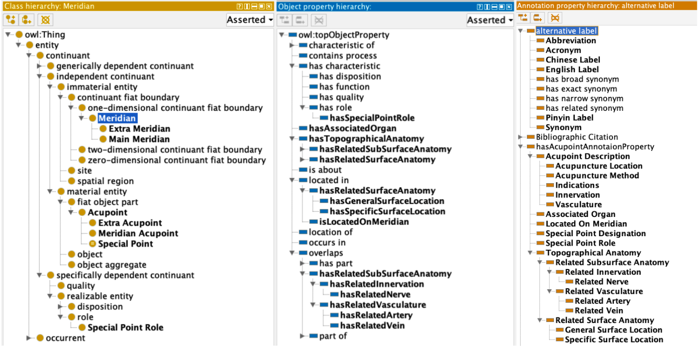

#### TARA Ontology - Basic Relationships Model

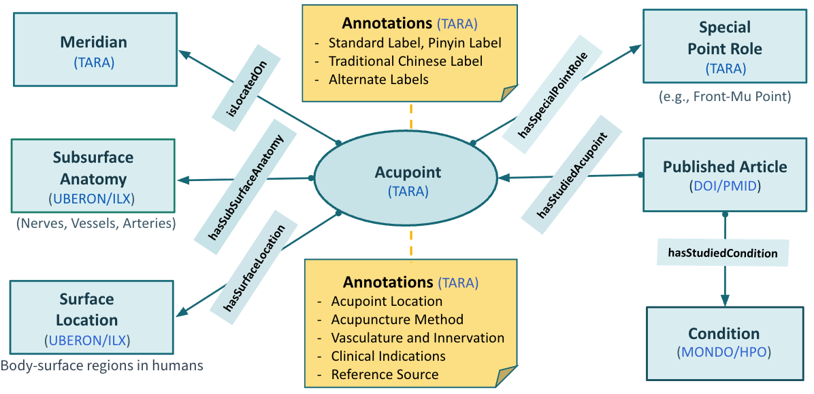

The diagram above provides a high-level depiction of possible relationships for Acupoints in the TARA Acupoints Ontology. It should be noted that not all acupoints require relationships with meridians as there are many acupoints that do not belong to the standard meridian system. Also, not all acupoints have special point designations. Only the acupoints of the 12 main meridians and 2 extra meridians, namely the Governor Vessel and the Conception Vessel, have some special point roles.

#### TARA Acupoints Annotation Properties

The core ontology defines a top-level property called **`hasAcupointAnnotaionProperty`** which groups all acupoint-specific annotation properties. The table below lists the 12 sub-properties of `hasAcupointAnnotaionProperty` along with a brief description of each. LU 1 (Zhongfu) is used as the running example.


| Property                     | Label                | Description summary                                                                                                                    |
| ---------------------------- | -------------------- | -------------------------------------------------------------------------------------------------------------------------------------- |
| `hasRelated SurfaceAnatomy`  | *(grouping)*         | Groups the two location sub-properties below                                                                                           |
| `hasGeneralSurfaceLocation`  | General Body Region  | General body region on whose surface the acupoint is located (e.g., LU 1 → Anterior Thoracic Region)                                  |
| `hasSpecificSurfaceLocation` | Specific Body Region | Specific anatomical structures within that region (e.g., LU 1 → First Intercostal Space, Infraclavicular Fossa, Anterior Median Line) |
| `hasAcupointDescription`     | Acupoint Description | Groups the five textual description sub-properties below                                                                               |
| `hasLocationalDescription`   | Acupuncture Location | Canonical WHO textual location description                                                                                             |
| `hasMethodDescription`       | Acupuncture Method   | Needling method including angle, depth, and moxibustion applicability                                                                  |
| `hasIndicationsDescription`  | Indications          | Clinical indications per TCM                                                                                                           |
| `hasVasculatureDescription`  | Vasculature          | Blood vessels in the vicinity relevant to safe needling                                                                                |
| `hasInnervationDescription`  | Innervation          | Nerve supply in the vicinity relevant to safe needling                                                                                 |
| `hasDesignatedOrgan`         | *(no label)*         | Organ designated to be affected per TCM theory (e.g., LU 1 → Lung)                                                                    |
| `hasSpecialPointRole`        | Special Point Role   | Named special point role(s) as textual annotation (cross-references`hasSpecialPointDesignation`)                                       |
| `hasMeridian`                | Meridian Membership  | Meridian the acupoint belongs to (e.g., LU 1 → Lung Meridian)                                                                         |

#### TARA Acupoints Object Properties

The table below lists all TARA-specific object properties, their parent RO relation (ID and label), a concrete example, and the `dc:description` from the core ontology file.


| Property                             | RO parent  | RO label   | Example                                                                      | Description                                                                                                                                                                                                                                                                                                                                                                                                                                                     |
| ------------------------------------ | ---------- | ---------- | ---------------------------------------------------------------------------- | --------------------------------------------------------------------------------------------------------------------------------------------------------------------------------------------------------------------------------------------------------------------------------------------------------------------------------------------------------------------------------------------------------------------------------------------------------------- |
| `tara-op:hasAssociatedOrgan`         | —         | —         | Lung Meridian → Lung                                                        | An object property that relates a meridian to the organ it is associated with according to traditional Chinese medicine theory (e.g., the Lung Meridian is associated with the Lung). Used to express the organ affiliation of a meridian as an OWL axiom.                                                                                                                                                                                                      |
| `tara-op:isLocatedOnMeridian`        | RO:0001025 | located in | LU 1 → Lung Meridian                                                        | An object property that relates an acupoint to the meridian it is located on (e.g., LU 1 isLocatedOnMeridian some Lung Meridian).                                                                                                                                                                                                                                                                                                                               |
| `tara-op:hasSpecialPointRole`        | RO:0000087 | has role   | LU 1 → Front-Mu Point of the Lung Role                                      | An object property that relates an acupoint to the special role it bears (e.g., LU 1 hasSpecialPointRole some 'Front-Mu Point of the Lung Role').                                                                                                                                                                                                                                                                                                               |
| `tara-op:hasGeneralSurfaceLocation`  | RO:0001025 | located in | LU 1 → Anterior Thoracic Region                                             | An object property that relates an acupoint to the general body region on whose surface it is located (e.g., LU 1 tara-op:hasGeneralSurfaceLocation some 'Anterior Thoracic Region'). It is a sub-property of the RO relation 'located in' (RO:0001025) and corresponds to the annotation property`tara:hasGeneralSurfaceLocation`.                                                                                                                             |
| `tara-op:hasSpecificSurfaceLocation` | RO:0001025 | located in | LU 1 → First Intercostal Space, Infraclavicular Fossa, Anterior Median Line | An object property that relates an acupoint to one or more specific anatomical structures in whose vicinity it is located on the body surface (e.g., LU 1 tara-op:hasSpecificSurfaceLocation some 'First Intercostal Space', 'Infraclavicular Fossa', and 'Anterior Median Line', all within the 'Anterior Thoracic Region'). It is a sub-property of the RO relation 'located in' (RO:0001025) and corresponds to the annotation property`hasRelatedLocation`. |

### TARA Ontology - Example Hierarchies

This section provides a set of Protégé screenshot examples of the basic hierarchies used in the TARA Acupoints Ontology.

#### Hierarchy of the Meridians

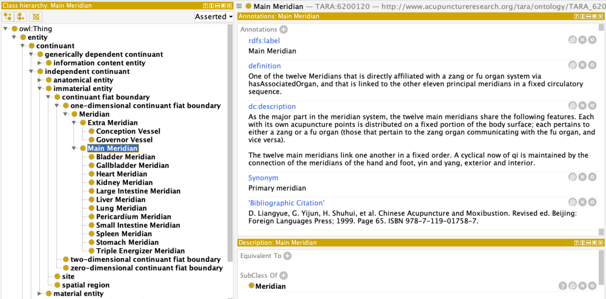

Hierarchy of the Meridian Acupoints

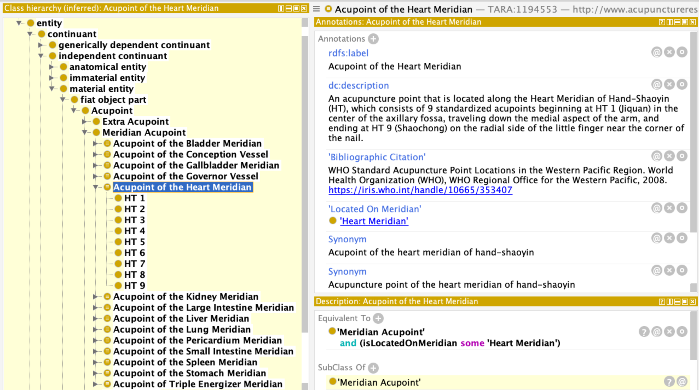

Classification of the Special Acupoints

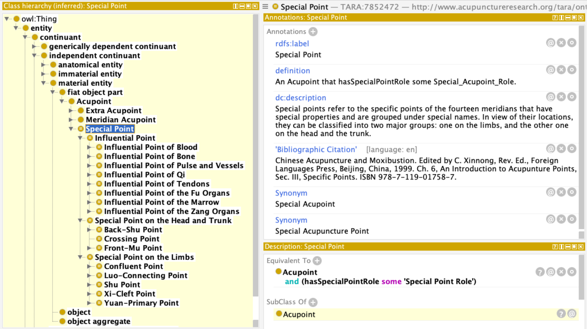

Inferred Special Points Classification of Acupoints

The example shows the inferred subclasses of a special acupuncture point called the "Xi-Cleft Point". The subclasses are the acupoints of different meridians that are considered to be Xi-Cleft points.

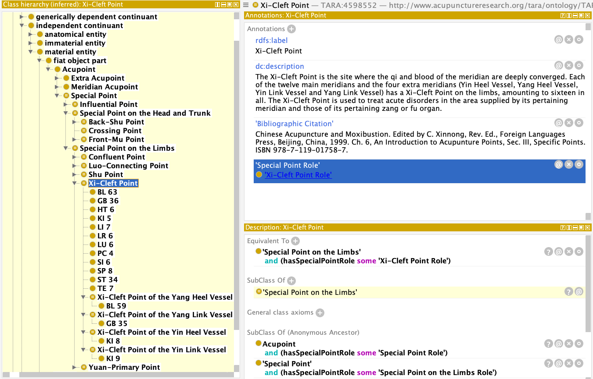

### TARA Ontology - DL Query Examples

The [DL Query tab](https://protegewiki.stanford.edu/wiki/DLQueryTab) in Protégé provides a powerful feature for testing a classified ontology using class expressions in a standard Description Logic (DL) syntax called the Manchester OWL syntax.

- Before using the DL Query tab, make sure to run the reasoner by selecting `Reasoner > Select HermiT > Start reasoner` in Protégé.

This section provides a set of example DL queries to test the basic classifications of the TARA Acupoints Ontology.

#### DL Queries on Acupoints of the Meridians

**Q: What are the acupuncture points in the Heart Meridian?**

```
'Meridian Acupoint' that isMemberAcupointOf some 'Heart Meridian'
```

Since we have defined a named class called `'Acupoint of the Heart Meridian'` in the ontology that is equivalent to the class expression above, we can achieve the same result by simply typing the named class as the DL Query.

```
'Acupoint of the Heart Meridian'
```

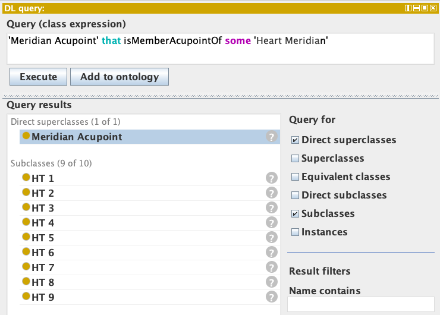

#### DL Queries on Acupoints with Special Point Roles

**Q. What are the Xi-Cleft Points in the main meridians?**

```
'Meridian Acupoint' that hasSpecialPointDesignation some 'Xi-Cleft Point Role'
```

Again, since we have defined a named class called 'Xi-Cleft Point' in the ontology as equivalent to the class expression above, we can achieve the same result by typing `'Meridian Acupoint' and 'Xi-Cleft Point'`.

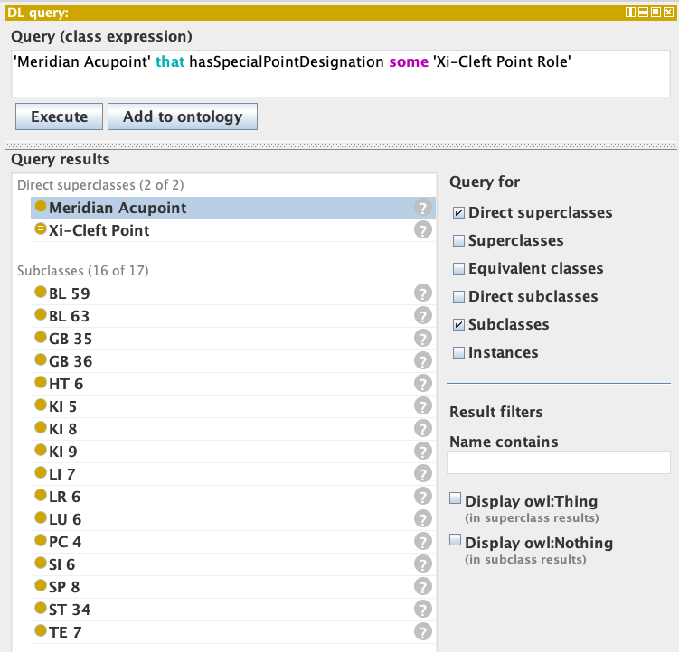

**Q: What are the Xi-Cleft Points on the Kidney Meridian?**

```
'Xi-Cleft Point' and isMemberAcupointOf some (Meridian 
                 and hasAssociatedOrgan some kidney)
```

We are essentially looking for the Xi-Cleft points in the Kidney Meridian. Since we have a defined class called the 'Acupoint of the Kidney Meridian' as equivalent to `'Meridian Acupoint' and (isMemberAcupointOf some 'Kidney Meridian')` and 'Kidney Meridian' is a subclass of `'Main Meridian' and (hasAssociatedOrgan some kidney)`, we can simply type:

```
'Xi-Cleft Point' and 'Acupoint of the Kidney Meridian'
```

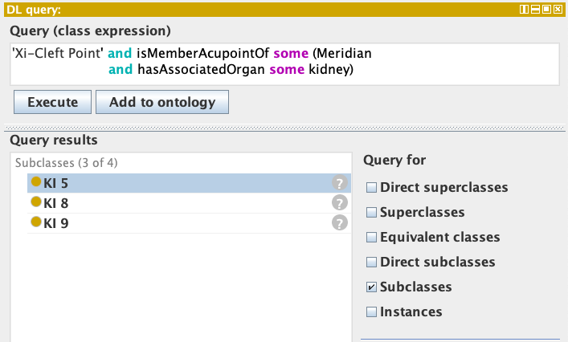

**Q. What are the 8 Confluent Points of the main meridians?**

```
'Confluent Point' and isMemberAcupointOf some 'Main Meridian'
```

Without using the defined class called 'Confluent Point', we would need to use:

```
'Meridian Acupoint' and (hasSpecialPointDesignation some 'Confluent Point Role')
```

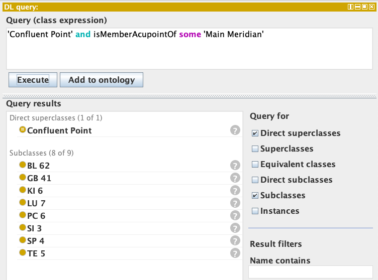

**Q. What are the 15 Luo-Connecting Points of the meridians?**

```
'Meridian Acupoint' and 'Luo-Connecting Point'
```

Without using the defined class:

```
'Meridian Acupoint' and hasSpecialPointDesignation some 'Luo-Connecting Point Role'
```

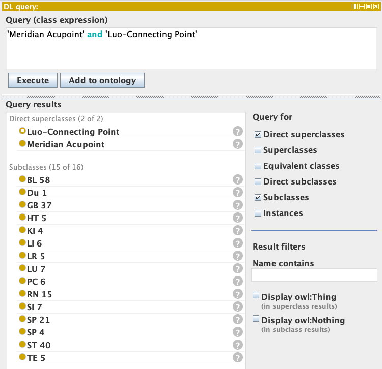

#### DL Queries Related to Acupoints Locations

**Q. What meridian acupoints can be located on the surface of the face?**

```
'Meridian Acupoint' and (locatedOnTheSurfaceOf some ('part of' some face))
```

**Q. What meridian acupoints can be located on the surface of the chest?**

```
Acupoint and (locatedOnTheSurfaceOf some ('part of' some chest))
```

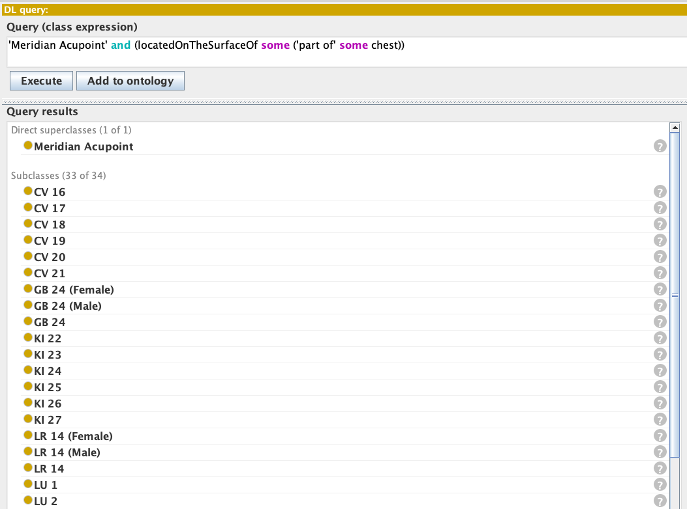

**Q. What acupoints are located on the surface of the legs?**

```
Acupoint and locatedInRelationTo some ('part of' some leg)
```

**Q: What acupoints are located on the surface of the forearm?**

```
Acupoint and (locatedInRelationTo some ('part of' some 'forelimb zeugopod'))
```

## Accessing and Exploring TARA Ontology

### Accessing TARA Ontology Files

The latest TARA Acupoints Ontology files are always available as raw Turtle (`.ttl`) files directly from the repository. The table below lists the primary files and their direct download links.


| File                                                                                                                                                                                  | Description                                                                                                                                                                         | Raw Link                                                                                                                                                         |
| ------------------------------------------------------------------------------------------------------------------------------------------------------------------------------------- | ----------------------------------------------------------------------------------------------------------------------------------------------------------------------------------- | ---------------------------------------------------------------------------------------------------------------------------------------------------------------- |
| [tara-acupoints.ttl](https://raw.githubusercontent.com/smtifahim/TARA-Ontology-Repository/refs/heads/master/ontology-files/generated/ttl/tara-acupoints.ttl)                          | **Asserted ontology** — the primary ontology file containing all curated acupoints, meridians, locations, and relationships as authored.                                           | [Download](https://raw.githubusercontent.com/smtifahim/TARA-Ontology-Repository/refs/heads/master/ontology-files/generated/ttl/tara-acupoints.ttl)               |
| [tara-acupoints-inferred.ttl](https://raw.githubusercontent.com/smtifahim/TARA-Ontology-Repository/master/ontology-files/generated/ttl/tara-acupoints-inferred.ttl)                   | **Inferred ontology** — merges asserted and reasoner-inferred axioms of the acupoints ontology plus the upper ontology into a single Turtle file.                                  | [Download](https://raw.githubusercontent.com/smtifahim/TARA-Ontology-Repository/master/ontology-files/generated/ttl/tara-acupoints-inferred.ttl)                 |
| [tara-articles-kb-inferred.ttl](https://raw.githubusercontent.com/smtifahim/TARA-Ontology-Repository/refs/heads/master/ontology-files/generated/ttl/kb/tara-articles-kb-inferred.ttl) | **Full knowledge base (inferred)** — merges the asserted and inferred axioms of the acupoints ontology, upper ontology, and annotated articles metadata into a single Turtle file. | [Download](https://raw.githubusercontent.com/smtifahim/TARA-Ontology-Repository/refs/heads/master/ontology-files/generated/ttl/kb/tara-articles-kb-inferred.ttl) |

### Loading TARA Ontology in Protégé Desktop

The easiest way to explore the ontology is to load it in **Protégé**. Protégé is a free, open-source ontology editor which you can download from [this link](https://protege.stanford.edu/software.php#desktop-protege).

- Make sure to download the Protégé Desktop Version 5.5.X or higher. If you are not familiar with the Protégé interface there is a "Getting Started" document [linked here](https://protegeproject.github.io/protege/getting-started/).
- Click `File > Open From URL..` in Protégé and copy/paste the [**TARA Acupoints Ontology Link**](https://raw.githubusercontent.com/smtifahim/TARA-Ontology-Repository/refs/heads/master/ontology-files/generated/ttl/tara-acupoints.ttl) under the `URI` field. Clicking the `OK` button will load the ontology in Protégé.

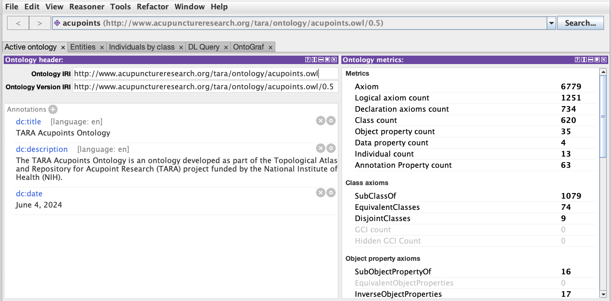

The screenshot above is from TARA Acupoints Ontology - Version 0.5.

### Exploring TARA Ontology in WebProtégé

The inferred version of the TARA Acupoints Ontology is available to explore via **WebProtégé**. WebProtégé is an open source, lightweight, web-based ontology viewer and editor. The ontology is available in WebProtégé *only for viewing and commenting*. The idea is to gather feedback from acupoint experts.

- If you don't have an account in WebProtégé, [create an account using this link](https://webprotege.stanford.edu/).
- Simply navigate to the following link: [TARA Acupoints Ontology in WebProtégé](https://webprotege.stanford.edu/#projects/2034c886-40f5-4c5e-92fb-037d54c7e286/edit/Classes?selection=Class(%3Chttp://www.acupunctureresearch.org/tara/ontology/TARA_1132428%3E)))
- If you are new to WebProtégé, please visit the [WebProtégé User Guide](https://protegewiki.stanford.edu/wiki/WebProtegeUsersGuide).

### Exploring TARA Ontology in NCBO BioPortal

All major versions of the TARA Acupoints Ontology can be explored via BioPortal: [https://bioportal.bioontology.org/ontologies/TARA](https://bioportal.bioontology.org/ontologies/TARA). BioPortal contains the inferred hierarchy of the acupoints with all anotation properties.

### Exploring TARA Ontology via SPARQL in Stardog

The TARA Acupoints Ontology is hosted on [Stardog Cloud](https://www.stardog.com/) and is accessible via a public SPARQL endpoint. You can run SPARQL queries directly against this endpoint using the Jupyter Notebook provided in the [`sparql/`](./sparql/) directory.

* A set of [example queries are available in the Jupyter Notebook](https://github.com/smtifahim/TARA-Ontology-Repository/blob/master/sparql/tara-sparql-queries.ipynb) to explore the TARA Acupoints Ontology.
* To run the example queries in the notebook, you will need [Jupyter Notebook](https://jupyter.org/install) with the [SPARQL kernel](https://github.com/paulovn/sparql-kernel) installed.
* The notebook ([`sparql/tara-sparql-queries.ipynb`](https://github.com/smtifahim/TARA-Ontology-Repository/blob/master/sparql/tara-sparql-queries.ipynb)) uses SPARQL kernel magics to configure the connection to the Stardog SPARQL Endpoint.

#### SPARQL Query Examples

**Q. List all the acupoints along with their meridians, special point role, and surface regions.**

```SPARQL
PREFIX rdf: <http://www.w3.org/1999/02/22-rdf-syntax-ns#>
PREFIX owl: <http://www.w3.org/2002/07/owl#>
PREFIX rdfs: <http://www.w3.org/2000/01/rdf-schema#>
PREFIX xsd: <http://www.w3.org/2001/XMLSchema#>
PREFIX TARA: <http://www.acupunctureresearch.org/tara/ontology/>

SELECT DISTINCT ?acupoint_iri ?acupoint ?meridian ?special_point_role ?surface_region
WHERE 
{
    ?acupoint_iri TARA:hasMeridian/rdfs:label ?meridian.
    ?acupoint_iri rdfs:subClassOf/rdfs:label "Meridian Acupoint".
    OPTIONAL { ?acupoint_iri TARA:hasDesignatedSpecialPointRole/rdfs:label ?special_point_role. }
    OPTIONAL 
    {   
        ?acupoint_iri TARA:hasSurfaceLocation ?surface_region_iri.
        ?surface_region_iri rdfs:label ?surface_region.
    }
    FILTER (!regex(str(?acupoint), 'Acupoint of the'))
    ?acupoint_iri rdfs:label ?acupoint.
}
ORDER BY ?meridian ?acupoint
LIMIT 1000
```

**Q. What surface regions are associated with a particular acupoint (e.g., LU 9)?**

```SPARQL
PREFIX rdf: <http://www.w3.org/1999/02/22-rdf-syntax-ns#>
PREFIX owl: <http://www.w3.org/2002/07/owl#>
PREFIX rdfs: <http://www.w3.org/2000/01/rdf-schema#>
PREFIX xsd: <http://www.w3.org/2001/XMLSchema#>
PREFIX TARA: <http://www.acupunctureresearch.org/tara/ontology/>

SELECT ?acupoint ?related_region ?related_region_iri ?surface_region ?surface_region_iri
WHERE 
{
    FILTER (?acupoint = 'LU 9'). 
    ?acupoint_iri TARA:hasRelatedLocation ?related_region_iri.
    ?acupoint_iri TARA:hasSurfaceLocation ?surface_region_iri.
    ?acupoint_iri rdfs:label ?acupoint.
    ?surface_region_iri rdfs:label ?surface_region.
    ?related_region_iri rdfs:label ?related_region.
}
ORDER BY ?acupoint
LIMIT 10
```

**Query Result:**


| acupoint | related_region                  | related_region_iri | surface_region | surface_region_iri |
| -------- | ------------------------------- | ------------------ | -------------- | ------------------ |
| LU 9     | abductor pollicis longus tendon | ILX:0795335        | carpal region  | UBERON:0004452     |
| LU 9     | carpal region                   | UBERON:0004452     | carpal region  | UBERON:0004452     |
| LU 9     | palmar wrist crease             | ILX:0795334        | carpal region  | UBERON:0004452     |
| LU 9     | radiale                         | UBERON:0001427     | carpal region  | UBERON:0004452     |
| LU 9     | styloid process of radius       | UBERON:7500078     | carpal region  | UBERON:0004452     |
| LU 9     | radial artery                   | UBERON:0001404     | carpal region  | UBERON:0004452     |

**Q. What surface regions are connected by a given meridian (e.g., Lung Meridian)?**

```SPARQL
PREFIX rdf: <http://www.w3.org/1999/02/22-rdf-syntax-ns#>
PREFIX owl: <http://www.w3.org/2002/07/owl#>
PREFIX rdfs: <http://www.w3.org/2000/01/rdf-schema#>
PREFIX xsd: <http://www.w3.org/2001/XMLSchema#>
PREFIX TARA: <http://www.acupunctureresearch.org/tara/ontology/>

SELECT DISTINCT 
    ?meridian ?acupoint
    ?surface_region ?surface_region_iri
    ?related_region ?related_region_iri 
WHERE 
{
    FILTER (?meridian = 'Lung Meridian'). 
    ?acupoint_iri TARA:hasMeridian ?meridian_iri.
    ?acupoint_iri TARA:hasRelatedLocation ?related_region_iri.
    ?acupoint_iri TARA:hasSurfaceLocation ?surface_region_iri.
    ?acupoint_iri rdfs:label ?acupoint.
    ?meridian_iri rdfs:label ?meridian.
    ?surface_region_iri rdfs:label ?surface_region.
    ?related_region_iri rdfs:label ?related_region.
    FILTER (?related_region != ?surface_region)
}
ORDER BY ?meridian ?acupoint ?surface_region ?related_region
LIMIT 30
```

**Additional example queries will be added based on the use cases of the TARA ontology as part of this section.**

## Quick Useful Links

### TARA Ontology: Versions Summary

* For a detailed per-version change log and release notes, see the [Ontology Versions Summary](./ontology-files/generated/readme.md#ontology-versions-summary) section in the generated files readme.

### TARA Ontology: Archived Versions

* For a listing of all prior released versions and their archived files, see the [Archived Versions](./ontology-files/generated/readme.md#archived-versions) section in the generated files readme.
